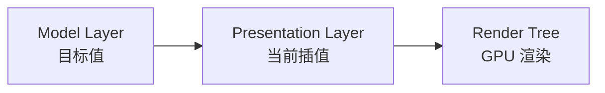
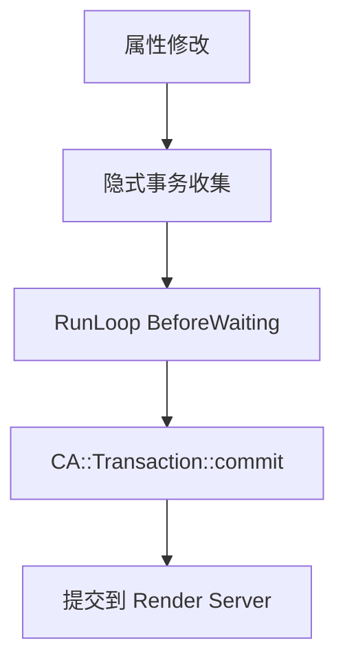

# 动画与 Core Animation

> Core Animation 是 iOS 动画的底层引擎——你用 UIView 写的每一行动画代码，最终都由它来执行。

你在 App 里看到的每一个流畅过渡、弹性回弹、渐隐渐出，背后都是 Core Animation 在驱动。它不仅仅是"做动画的框架"，更是 iOS 整个渲染管线的核心——即使你没有写任何动画代码，屏幕上的每一帧画面也是 Core Animation 提交给 GPU 渲染的。理解 Core Animation，就理解了 iOS 图形系统的运作方式。

面试中，Core Animation 是 iOS 高频考点：隐式动画和显式动画的区别、三棵树模型、`CATransaction` 的原理、动画性能优化——这些问题能直接区分"会用 API"和"真正理解底层"的候选人。

## CALayer 与 UIView

每个 `UIView` 背后都有一个 `CALayer`，两者分工明确：

| 职责 | UIView | CALayer |
|------|--------|---------|
| 事件处理 | 触摸事件、手势识别 | 不处理事件 |
| 布局 | Auto Layout、`layoutSubviews` | `layoutSublayers` |
| 渲染 | 调用 `draw(_:)` | 管理 `contents`、组合图层 |
| 动画 | 封装动画 API | **实际执行动画** |

**类比**：UIView 是演员（接受导演指令、和观众互动），CALayer 是演员的影像（真正出现在银幕上的画面）。你对演员说"走到舞台右边"，但观众看到的移动过程，是影像在处理。

```swift
let view = UIView(frame: CGRect(x: 0, y: 0, width: 100, height: 100))
view.backgroundColor = .red

// UIView 的属性实际上是 CALayer 属性的代理
view.layer.cornerRadius = 10    // 圆角
view.layer.shadowOpacity = 0.5  // 阴影
view.layer.borderWidth = 1      // 边框
```

::: tip 为什么要分成两层？
macOS 上 `NSView` 没有触摸事件但也需要渲染和动画。将渲染/动画职责抽到 `CALayer`，Apple 可以在 iOS 和 macOS 之间共享这套渲染引擎，`UIView` 和 `NSView` 只需各自处理事件即可。
:::

## 三棵树（Layer Trees）

Core Animation 内部维护**三棵图层树**，这是理解动画原理的关键：

| 图层树 | 作用 | 访问方式 |
|--------|------|---------|
| **Model Layer Tree** | 存储图层的**目标值**（动画结束后的最终状态） | `layer`（默认访问的就是 Model Layer） |
| **Presentation Layer Tree** | 存储动画**过程中的当前值**（屏幕上此刻的实际状态） | `layer.presentation()` |
| **Render Tree** | Render Server 进程中的私有副本，直接提交给 GPU | 无法直接访问 |



**类比**：你在导航 App 上设置了目的地（Model Layer），车辆当前位置在实时移动（Presentation Layer），而手机屏幕上显示的画面是最终渲染结果（Render Tree）。

### 为什么要区分 Model 和 Presentation？

当你设置 `layer.position = CGPoint(x: 200, y: 100)` 并触发动画时：
- **Model Layer** 立即变成 `(200, 100)`——动画还没开始，目标值就已经确定了
- **Presentation Layer** 从旧位置平滑过渡到新位置——这才是用户看到的
- 动画结束后，两者重合

```swift
// 动画进行中读取两棵树的值
UIView.animate(withDuration: 1.0) {
    view.frame.origin.x = 200
}

// 动画过程中：
print(view.layer.position)              // (200, ...) — Model Layer，已经是目标值
print(view.layer.presentation()?.position)  // (87.3, ...) — Presentation Layer，当前位置
```

::: warning 点击测试的陷阱
动画过程中做 hit testing，默认检测的是 **Model Layer**（已经在终点）。如果你想检测动画中的"当前可见位置"，需要用 `layer.presentation()` 的 frame 来判断。
:::

## 隐式动画

修改一个**独立 CALayer**（不是 UIView 的 backing layer）的可动画属性时，Core Animation 会自动生成一个 0.25 秒的平滑过渡——这就是**隐式动画**，你不需要写任何动画代码。

```swift
let layer = CALayer()
layer.frame = CGRect(x: 50, y: 50, width: 100, height: 100)
layer.backgroundColor = UIColor.red.cgColor
view.layer.addSublayer(layer)

// 直接修改属性 → 自动触发 0.25s 隐式动画
layer.position = CGPoint(x: 200, y: 200)   // 平滑移动
layer.backgroundColor = UIColor.blue.cgColor // 颜色渐变
layer.opacity = 0.5                          // 透明度渐变
```

### 可动画属性

| 属性 | 说明 |
|------|------|
| `position` / `bounds` | 位置和大小 |
| `backgroundColor` | 背景色 |
| `opacity` | 透明度 |
| `transform` | 旋转、缩放、平移 |
| `cornerRadius` | 圆角 |
| `borderWidth` / `borderColor` | 边框 |
| `shadowColor` / `shadowOffset` / `shadowOpacity` | 阴影 |
| `contents` | 图层内容（图片） |

### UIView 的 backing layer 为什么没有隐式动画？

`UIView` 实现了 `CALayerDelegate` 的 `action(forLayer:forKey:)` 方法。在非动画上下文中，这个方法返回 `NSNull()`，告诉 Core Animation"不要自动添加动画"。

```swift
// UIView 内部的实现（伪代码）
func action(forLayer layer: CALayer, forKey key: String) -> CAAction? {
    if 当前在动画block内 {
        return nil  // 返回 nil → 使用默认隐式动画
    } else {
        return NSNull()  // 返回 NSNull → 禁止隐式动画
    }
}
```

这就是为什么在 `UIView.animate` 闭包里修改属性有动画，而在外面直接修改没有动画——闭包内部改变了 `action(forLayer:forKey:)` 的返回值。

## 显式动画

显式动画需要你主动创建动画对象，可以精确控制时间、路径、缓动曲线等。

### UIView 动画（最常用）

```swift
// 基础动画
UIView.animate(withDuration: 0.3) {
    view.alpha = 0
    view.transform = CGAffineTransform(scaleX: 1.2, y: 1.2)
}

// 带弹性效果（iOS 7+）
UIView.animate(withDuration: 0.6,
               delay: 0,
               usingSpringWithDamping: 0.6,    // 阻尼系数，越小越弹
               initialSpringVelocity: 0,
               options: [],
               animations: {
    view.center = CGPoint(x: 200, y: 300)
}, completion: nil)
```

### CABasicAnimation

从一个值平滑过渡到另一个值：

```swift
let anim = CABasicAnimation(keyPath: "position.x")
anim.fromValue = 50
anim.toValue = 250
anim.duration = 0.5
anim.timingFunction = CAMediaTimingFunction(name: .easeInEaseOut)

// 关键：动画结束后保持最终状态
anim.fillMode = .forwards
anim.isRemovedOnCompletion = false

layer.add(anim, forKey: "moveX")
```

::: warning fillMode 的坑
`fillMode = .forwards` + `isRemovedOnCompletion = false` 只是让动画"视觉上停留"在终点，**Model Layer 的值并没有改变**。正确做法是在添加动画前先把 Model Layer 的值设为目标值：

```swift
layer.position.x = 250  // 先更新 Model Layer
let anim = CABasicAnimation(keyPath: "position.x")
anim.fromValue = 50      // 从旧值开始动画
anim.toValue = 250
layer.add(anim, forKey: "moveX")
```
:::

### CAKeyframeAnimation

沿多个关键帧或路径做动画：

```swift
let anim = CAKeyframeAnimation(keyPath: "position")
anim.values = [
    CGPoint(x: 50, y: 50),
    CGPoint(x: 200, y: 50),
    CGPoint(x: 200, y: 300),
    CGPoint(x: 50, y: 300),
]
anim.keyTimes = [0, 0.3, 0.6, 1.0]  // 每个关键帧的时间点
anim.duration = 2.0
layer.add(anim, forKey: "square")
```

### CASpringAnimation

iOS 9+ 的弹簧动画，物理参数可调：

```swift
let spring = CASpringAnimation(keyPath: "position.y")
spring.fromValue = 100
spring.toValue = 400
spring.damping = 5          // 阻尼（越小越弹）
spring.stiffness = 100      // 刚度（越大弹得越快）
spring.mass = 1             // 质量（越大越慢）
spring.initialVelocity = 0
spring.duration = spring.settlingDuration  // 自动计算所需时间
layer.add(spring, forKey: "bounce")
```

### CAAnimationGroup

组合多个动画同时执行：

```swift
let move = CABasicAnimation(keyPath: "position.x")
move.toValue = 250

let fade = CABasicAnimation(keyPath: "opacity")
fade.toValue = 0.3

let group = CAAnimationGroup()
group.animations = [move, fade]
group.duration = 0.5
layer.add(group, forKey: "moveAndFade")
```

### 显式动画对比

| 类型 | 适用场景 | 复杂度 |
|------|---------|--------|
| `UIView.animate` | 日常 UI 动画，90% 场景够用 | 低 |
| `CABasicAnimation` | 需要控制 keyPath、从/到值 | 中 |
| `CAKeyframeAnimation` | 多段路径、非线性运动 | 中 |
| `CASpringAnimation` | 物理弹簧效果 | 中 |
| `CAAnimationGroup` | 组合多个动画 | 中 |

## CATransaction

`CATransaction` 是 Core Animation 的**事务机制**，用于批量管理图层属性的修改和动画。

每一轮 RunLoop 中，Core Animation 自动创建一个隐式事务，收集所有图层变更，在 RunLoop 即将休眠时统一提交（`CA::Transaction::commit()`）。

### 控制隐式动画

```swift
// 禁用隐式动画
CATransaction.begin()
CATransaction.setDisableActions(true)
layer.position = CGPoint(x: 200, y: 200)  // 没有动画，直接跳到目标位置
CATransaction.commit()

// 修改隐式动画时长
CATransaction.begin()
CATransaction.setAnimationDuration(1.0)  // 改为 1 秒
layer.opacity = 0
CATransaction.commit()

// 动画完成回调
CATransaction.begin()
CATransaction.setCompletionBlock {
    print("动画完成")
}
layer.backgroundColor = UIColor.green.cgColor
CATransaction.commit()
```

### CATransaction 与 RunLoop 的关系



Core Animation 注册了一个优先级为 2000000 的 RunLoop Observer，监听 `BeforeWaiting` 和 `Exit` 事件。当 RunLoop 即将休眠时，触发 `commit()`，将所有待处理的布局、绘制和图层变更打包发送给 Render Server 进程。

## CADisplayLink

`CADisplayLink` 是一个和屏幕刷新率同步的定时器。每次屏幕刷新时触发回调，是实现**自定义逐帧动画**和**FPS 监控**的核心工具。

```swift
let displayLink = CADisplayLink(target: self, selector: #selector(update))
displayLink.add(to: .main, forMode: .common)  // .common 保证滚动时也触发

@objc func update(link: CADisplayLink) {
    let fps = 1.0 / (link.targetTimestamp - link.timestamp)
    // 每帧更新动画状态
}

// 不用时必须手动停止
displayLink.invalidate()
```

| 对比 | CADisplayLink | NSTimer |
|------|--------------|---------|
| 触发频率 | 和屏幕刷新同步（60/120 Hz） | 自定义间隔 |
| 精度 | 高（VSync 驱动） | 低（受 RunLoop 负载影响） |
| 适用场景 | 逐帧动画、FPS 监控 | 定时任务、延迟操作 |
| RunLoop 模式 | 需要加到 `.common` | 默认 `.default` |

::: tip ProMotion 自适应刷新率
iPhone 13 Pro+ 支持 ProMotion（10~120 Hz 自适应）。iOS 15+ 可以用 `preferredFrameRateRange` 指定期望帧率范围：

```swift
displayLink.preferredFrameRateRange = CAFrameRateRange(
    minimum: 30, maximum: 120, preferred: 60
)
```
:::

## 动画性能优化

### GPU 友好的动画属性

有些属性修改不需要重新布局和绘制，直接在 GPU 层面完成，性能最好：

| 属性 | CPU 参与度 | 说明 |
|------|-----------|------|
| `opacity` | 极低 | 直接在 GPU 合成时调整 |
| `transform` | 极低 | GPU 矩阵变换，不重绘内容 |
| `position` / `bounds` | 低 | 可能触发子视图布局 |
| `backgroundColor` | 中 | 需要重新生成纹理 |
| `cornerRadius` + `masksToBounds` | 高 | 可能触发离屏渲染 |
| `shadow*`（无 shadowPath） | 高 | 每帧计算阴影路径，非常耗 |

### 优化建议

1. **优先用 transform 做动画**——缩放用 `transform.scale`，移动用 `transform.translation`，比直接改 `frame` 高效
2. **阴影加 shadowPath**——手动指定阴影路径，避免每帧重新计算

```swift
layer.shadowPath = UIBezierPath(roundedRect: layer.bounds,
                                 cornerRadius: layer.cornerRadius).cgPath
```

3. **圆角用 `layer.cornerRadius`**——iOS 9+ 不再触发离屏渲染（除非同时设置 `masksToBounds` + 子图层）
4. **大量 Cell 动画用 `shouldRasterize`**——将复杂图层光栅化为位图缓存

```swift
layer.shouldRasterize = true
layer.rasterizationScale = UIScreen.main.scale
```

::: warning shouldRasterize 的代价
光栅化缓存有 100ms 有效期，超时重新生成。如果图层内容频繁变化（如动态文字），光栅化反而更慢。只对静态内容使用。
:::

## 面试高频问题

### Q1: 隐式动画和显式动画的区别？⭐⭐⭐

**答题思路**：
1. 隐式动画：修改独立 CALayer 的可动画属性时自动触发，默认 0.25 秒
2. 显式动画：主动创建 `CABasicAnimation` 等对象或使用 `UIView.animate`
3. UIView 的 backing layer 没有隐式动画——因为 `action(forLayer:forKey:)` 返回 `NSNull`
4. 加分：在 `UIView.animate` 闭包内，该方法返回 `nil`，此时 backing layer 恢复隐式动画能力

### Q2: Core Animation 的三棵树是什么？⭐⭐⭐

**答题思路**：
1. Model Layer Tree：存储目标值（最终状态），设置属性后立即更新
2. Presentation Layer Tree：存储动画过程中的插值状态（当前屏幕显示的值）
3. Render Tree：在独立的 Render Server 进程中，负责实际 GPU 渲染
4. 加分：动画过程中做 hit testing 需要检查 `presentation()` 而不是 Model Layer

### Q3: CATransaction 是什么？怎么用？⭐⭐

**答题思路**：
1. Core Animation 的事务机制，批量收集图层变更
2. RunLoop 每轮自动创建隐式事务，BeforeWaiting 时统一提交
3. 可以用 `setDisableActions(true)` 禁用隐式动画
4. 可以用 `setAnimationDuration` 修改隐式动画时长，用 `setCompletionBlock` 添加回调

### Q4: 怎么做动画性能优化？⭐⭐

**答题思路**：
1. 优先用 `opacity` 和 `transform` 做动画——不触发重绘，GPU 直接处理
2. 阴影必须设置 `shadowPath`，否则每帧重新计算
3. 避免在动画中触发离屏渲染（圆角 + `masksToBounds` + 子图层组合）
4. 加分：iOS 15+ 关注 Animation Hitches 指标（Commit Hitch / Render Hitch）

### Q5: CADisplayLink 和 NSTimer 的区别？⭐⭐

**答题思路**：
1. CADisplayLink 和屏幕刷新同步（VSync 驱动），精度高
2. NSTimer 受 RunLoop 模式和负载影响，精度低
3. 逐帧动画和 FPS 监控用 CADisplayLink，普通定时任务用 NSTimer
4. 加分：CADisplayLink 需要加到 `.common` 模式才能在滚动时继续触发

## 一张表回顾

| 知识点 | 核心要义 | 掌握程度 |
|--------|---------|---------|
| UIView vs CALayer | UIView 处理事件，CALayer 负责渲染和动画 | ⭐⭐⭐ 必须 |
| 三棵树 | Model（目标值）、Presentation（当前插值）、Render（GPU 渲染） | ⭐⭐⭐ 必须 |
| 隐式动画 | 修改独立 CALayer 属性自动触发，UIView backing layer 被禁用 | ⭐⭐⭐ 必须 |
| 显式动画 | UIView.animate / CABasicAnimation / CAKeyframeAnimation 等 | ⭐⭐⭐ 必须 |
| CATransaction | 事务机制，RunLoop BeforeWaiting 时 commit，可禁用隐式动画 | ⭐⭐ 理解 |
| CADisplayLink | 和屏幕刷新同步的定时器，用于逐帧动画和 FPS 监控 | ⭐⭐ 理解 |
| fillMode 陷阱 | `.forwards` 只保持视觉状态，Model Layer 未更新，应先设目标值 | ⭐⭐ 理解 |
| GPU 友好属性 | opacity、transform 最高效，shadow 无 path 最耗 | ⭐⭐ 理解 |
| CASpringAnimation | 物理弹簧动画，damping/stiffness/mass 可调 | ⭐ 了解 |
| ProMotion | iOS 15+ 自适应刷新率，preferredFrameRateRange | ⭐ 了解 |
