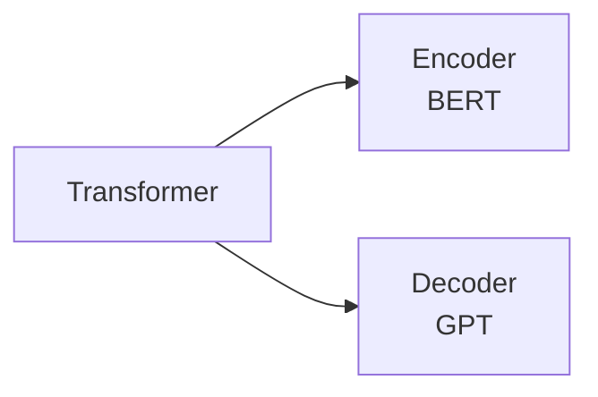
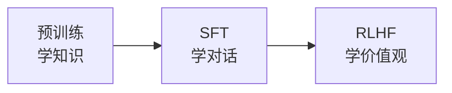

# LLM 原理与架构

> 大语言模型的本质就一件事——预测下一个 token。这个看似简单的目标，催生了 ChatGPT、Claude、Gemini 等改变世界的产品。

2022 年 ChatGPT 横空出世，让"大模型"从学术圈破圈到了每个人的日常。但面试中不能只说"我用过 ChatGPT"——你需要理解 LLM 是怎么工作的：Transformer 为什么取代了 RNN？预训练学到了什么？RLHF 为什么让模型变"听话"了？LoRA 是怎么用极少参数做微调的？这些问题覆盖了从算法原理到工程实践的核心知识点。

## 语言模型基础

**语言模型 = 给定前面的词，预测下一个词的概率分布。**

$$P(w_t \mid w_1, w_2, \ldots, w_{t-1})$$

你在手机键盘上打"今天天气"，键盘联想出"很好""不错""真热"——这就是一个简单的语言模型在工作。GPT 做的事情本质上一样，只不过它见过的文本量是整个互联网，预测能力强大到能写文章、写代码、做推理。

**类比**：语言模型就像一个读过所有书的"文字接龙高手"。你给它开头，它根据读过的所有内容，接出最合理的下一个词，一个接一个，直到完成整段话。

### Token 与 Tokenizer

LLM 不直接处理文字，而是处理 **token**——文本的最小单元。

| Tokenizer 类型 | 粒度 | 示例（"unhappiness"） |
|---------------|------|---------------------|
| 词级 | 整词 | `["unhappiness"]` |
| 字符级 | 单字符 | `["u","n","h","a","p","p","i","n","e","s","s"]` |
| **子词级（BPE）** | 子词 | `["un", "happi", "ness"]` |

现代 LLM 几乎都用 **BPE（Byte Pair Encoding）** 或其变体。它在词级和字符级之间取平衡：常见词保持完整，罕见词拆成子词片段——既控制了词表大小，又能处理任意新词。

```python
import tiktoken

enc = tiktoken.encoding_for_model("gpt-4")
tokens = enc.encode("大语言模型很强大")
print(tokens)       # [28990, 35946, 21028, 17713, ...]
print(len(tokens))  # 中文通常 1-2 个 token 表示一个汉字
```

## Transformer 核心机制

Transformer 是 LLM 的基础架构，2017 年 Google 论文 "Attention Is All You Need" 提出。它用**注意力机制**彻底取代了 RNN 的循环结构。

### 为什么取代 RNN？

| 问题 | RNN | Transformer |
|------|-----|------------|
| 长距离依赖 | 信息在链式传递中衰减 | 注意力直接连接任意两个位置 |
| 并行计算 | 必须按顺序处理（$t$ 依赖 $t-1$） | 所有位置同时计算 |
| 训练速度 | 慢（无法并行） | 快（GPU 友好） |

### 自注意力（Self-Attention）

自注意力的核心：让句子中的每个词"看到"其他所有词，并决定该关注谁。

$$\text{Attention}(Q, K, V) = \text{softmax}\left(\frac{QK^T}{\sqrt{d_k}}\right)V$$

- **Q（Query）**：当前词的"提问"——"我该关注谁？"
- **K（Key）**：每个词的"标签"——"我是什么角色？"
- **V（Value）**：每个词的"内容"——"我能提供什么信息？"

**类比**：你在图书馆找资料（Q），书架上每本书都有标签（K），你根据标签匹配度决定翻哪些书（softmax），然后从这些书中提取内容（V）。

除以 $\sqrt{d_k}$ 是为了防止内积值过大导致 softmax 输出过于集中（梯度消失）。

### 多头注意力（Multi-Head Attention）

一个注意力头只能捕捉一种关系模式。多头注意力并行运行多个注意力头，每个头关注不同维度的信息：

- 头 1 可能关注语法关系（主语-谓语）
- 头 2 可能关注语义关系（同义词、上下文）
- 头 3 可能关注位置关系（相邻词）

```python
import torch.nn as nn

# PyTorch 中的多头注意力
mha = nn.MultiheadAttention(embed_dim=512, num_heads=8)
# 512 维 embedding 被拆成 8 个头，每个头 64 维
```

### 位置编码（Positional Encoding）

注意力机制本身不包含位置信息——"猫吃鱼"和"鱼吃猫"在纯注意力视角中没有区别。位置编码给每个 token 注入位置信号。

| 方法 | 用于 | 特点 |
|------|------|------|
| 正弦位置编码 | 原始 Transformer | 固定函数，不可学习 |
| 可学习位置编码 | GPT、BERT | 位置向量作为参数训练 |
| **RoPE（旋转位置编码）** | LLaMA、Qwen | 支持外推到更长序列 |

## GPT 与 BERT

Transformer 的两种用法催生了两大家族：



| 对比项 | GPT | BERT |
|--------|-----|------|
| 架构 | Transformer **Decoder** | Transformer **Encoder** |
| 方向 | 单向（从左到右） | 双向（看到上下文） |
| 训练任务 | 预测下一个 token | 完形填空（Masked LM） |
| 擅长 | **生成**（写文章、对话、写代码） | **理解**（分类、抽取、问答） |
| 代表模型 | GPT-4、Claude、LLaMA | BERT、RoBERTa、DeBERTa |
| 当前主流 | 是（生成式 AI 主力） | 用于下游 NLP 任务 |

### GPT 系列演进

| 模型 | 年份 | 参数量 | 关键突破 |
|------|------|--------|---------|
| GPT-1 | 2018 | 1.17 亿 | 预训练 + 微调范式 |
| GPT-2 | 2019 | 15 亿 | 零样本学习涌现 |
| GPT-3 | 2020 | 1750 亿 | In-Context Learning，不微调也能做任务 |
| GPT-4 | 2023 | 未公开 | 多模态 + 推理能力飞跃 |

GPT-3 的关键发现：模型足够大后，不需要微调——只要在 prompt 中给几个示例（Few-shot），模型就能完成新任务。这催生了后来的 Prompt Engineering。

## 训练三阶段

现代 LLM 的训练不是一步到位的，而是分三个阶段，每个阶段解决不同的问题：



### Stage 1：预训练（Pre-training）

- **目标**：预测下一个 token
- **数据**：互联网文本（万亿 token 级别）
- **学到什么**：语言结构、世界知识、逻辑推理能力
- **代价**：成百上千张 GPU，训练几周到几个月，花费数百万美元

预训练后的模型（Base Model）已经"很聪明"，但它只会"接话"，不会按指令对话。你问它"北京的首都是什么？"，它可能会接"上海的首都是什么？天津的首都是什么？"——因为它在模仿训练数据中的列表格式。

### Stage 2：SFT（有监督微调）

- **目标**：让模型学会按指令回答问题
- **数据**：高质量的（指令, 回答）对，人工标注
- **效果**：模型从"文字接龙"变成"问答助手"

```
指令: 请用简单的语言解释什么是量子计算
回答: 量子计算利用量子力学的特性来处理信息...
```

SFT 的数据量不大（几万到几十万条），但质量要求极高——一条低质量数据的负面影响远大于一条高质量数据的正面影响。

### Stage 3：RLHF（人类反馈强化学习）

- **目标**：让模型的回答符合人类偏好——有帮助、无害、诚实
- **过程**：
  1. 模型对同一问题生成多个回答
  2. 人类标注员对回答排序（A > B > C）
  3. 用排序数据训练一个**奖励模型**（Reward Model）
  4. 用 PPO 等强化学习算法优化 LLM，让它生成奖励模型打分高的回答

**类比**：预训练是上学（学知识），SFT 是入职培训（学怎么和客户沟通），RLHF 是绩效考核（根据客户反馈改进服务态度）。

::: tip ChatGPT 为什么比 GPT-3 好用这么多？
GPT-3 只做了预训练，输出像在"续写文章"。ChatGPT 在 GPT-3.5 基础上加了 SFT + RLHF，让模型学会了"理解指令并有礼貌地回答"。技术上变化不大，但用户体验天壤之别。
:::

## 开源大模型

| 模型 | 组织 | 参数量 | 特点 |
|------|------|--------|------|
| LLaMA 2/3 | Meta | 7B ~ 70B | 开源标杆，社区生态最大 |
| Mistral / Mixtral | Mistral AI | 7B ~ 8×7B | 小参数高性能，MoE 架构 |
| Qwen 2.5 | 阿里 | 0.5B ~ 72B | 中文能力强，多模态 |
| Phi-3 | 微软 | 3.8B ~ 14B | 小模型高质量，**适合端侧部署** |
| Gemma 2 | Google | 2B ~ 27B | 轻量级，**支持 Core ML** |

::: tip iOS 开发者关注
Phi-3（3.8B）和 Gemma 2（2B）参数量小，可以通过 Core ML 或 `llama.cpp` 在 iPhone 上本地运行。Apple Intelligence 也是基于端侧小模型 + 云端大模型的混合架构。
:::

## 微调方法

全量微调要更新所有参数，对于 7B 模型需要 ~28GB 显存（FP32），普通开发者根本跑不起。**参数高效微调（PEFT）** 只训练极少量参数就能达到接近全量微调的效果。

### LoRA（Low-Rank Adaptation）

核心思想：冻结原始权重 $W$，只训练两个低秩矩阵 $A$ 和 $B$：

$$W' = W + \Delta W = W + BA$$

其中 $B \in \mathbb{R}^{d \times r}$，$A \in \mathbb{R}^{r \times d}$，$r \ll d$。

| 对比 | 全量微调 | LoRA (r=16) |
|------|---------|-------------|
| 训练参数（d=4096） | 1677 万 | 13.1 万（**128 倍压缩**） |
| 显存需求 | ~28GB | ~8GB |
| 训练速度 | 慢 | 快 |
| 效果 | 基准 | 接近全量微调 |

### QLoRA

在 LoRA 基础上，将冻结的原始权重量化到 4-bit（NF4 格式），进一步降低显存——**7B 模型用单张消费级 GPU（24GB）即可微调**。

```python
from peft import LoraConfig, get_peft_model

# 配置 LoRA
config = LoraConfig(
    r=16,                # 低秩维度
    lora_alpha=32,       # 缩放因子
    target_modules=["q_proj", "v_proj"],  # 只对注意力层的 Q 和 V 加 LoRA
    lora_dropout=0.05,
)

model = get_peft_model(base_model, config)
model.print_trainable_parameters()
# trainable params: 4,194,304 || all params: 6,742,609,920 || trainable%: 0.0622%
```

## 推理优化

训练好的模型部署时，推理速度和成本是核心挑战。

| 技术 | 原理 | 效果 |
|------|------|------|
| **KV Cache** | 缓存已计算的 Key/Value，避免重复计算 | 推理速度提升数倍 |
| **量化** | FP32 → INT8/INT4，减少内存和计算量 | 模型体积压缩 2~8 倍 |
| **Flash Attention** | 优化注意力的内存访问模式（tiling） | 速度 2~4 倍，显存减半 |
| **投机采样** | 小模型先生成草稿，大模型验证 | 加速 2~3 倍，不损失质量 |
| **MoE** | 每次只激活部分专家网络 | 参数量大但计算量小 |

### KV Cache

自回归生成时，每生成一个新 token 都要重新计算所有位置的注意力。KV Cache 把之前算过的 K 和 V 缓存下来，新 token 只需要计算自己的 Q 并与缓存做注意力——从 $O(n^2)$ 降到 $O(n)$。

::: warning KV Cache 的代价
缓存 K/V 需要额外显存。对于 70B 模型、序列长度 4096，KV Cache 可能占用数 GB 显存。这也是为什么"上下文窗口越长，需要的显存越多"。
:::

## 面试高频问题

### Q1: Transformer 的自注意力机制是什么？为什么要除以 $\sqrt{d_k}$？⭐⭐⭐

**答题思路**：
1. 自注意力让每个位置"关注"序列中所有其他位置，计算加权和
2. 通过 Q、K、V 三个矩阵：Q 和 K 算相关度（点积），softmax 归一化后加权 V
3. 除以 $\sqrt{d_k}$ 防止维度过高时点积值过大，导致 softmax 输出过于尖锐（梯度消失）
4. 加分：多头注意力并行多个头，捕捉不同维度的关系

### Q2: GPT 和 BERT 的区别？⭐⭐⭐

**答题思路**：
1. GPT 用 Decoder（单向，自回归生成），BERT 用 Encoder（双向，掩码预测）
2. GPT 擅长生成（写文章、对话），BERT 擅长理解（分类、抽取）
3. 当前主流是 GPT 路线（ChatGPT、Claude、LLaMA 都是 Decoder-only）
4. 加分：BERT 看到完整上下文所以理解更准，但无法自回归生成

### Q3: 预训练、SFT、RLHF 分别解决什么问题？⭐⭐⭐

**答题思路**：
1. 预训练：海量文本上学语言和知识（预测下一个 token）
2. SFT：高质量指令-回答对上学对话能力（学会按指令回答）
3. RLHF：根据人类偏好优化，变得有帮助、无害、诚实
4. 加分：ChatGPT 之所以好用，核心贡献是 RLHF，而不是模型更大

### Q4: LoRA 的原理是什么？为什么有效？⭐⭐

**答题思路**：
1. 冻结原始权重，只训练两个低秩矩阵 $\Delta W = BA$
2. 参数量从 $d^2$ 降到 $2dr$（r 通常 8~64），压缩百倍以上
3. 有效的原因：微调时权重的变化量本身是低秩的（任务相关的信息维度不高）
4. 加分：QLoRA 进一步将原始权重量化到 4-bit，单卡即可微调 7B 模型

### Q5: KV Cache 是什么？为什么能加速推理？⭐⭐

**答题思路**：
1. 自回归生成中，每个新 token 都要和前面所有 token 算注意力
2. KV Cache 缓存之前算好的 Key 和 Value，新 token 只算自己的 Query
3. 把每步的计算量从 $O(n^2)$ 降到 $O(n)$
4. 代价：占用额外显存，序列越长占用越多

## 一张表回顾

| 知识点 | 核心要义 | 掌握程度 |
|--------|---------|---------|
| 语言模型 | 预测下一个 token 的概率分布 | ⭐⭐⭐ 必须 |
| Tokenizer / BPE | 子词分词，平衡词表大小和覆盖率 | ⭐⭐ 理解 |
| 自注意力 | $\text{softmax}(QK^T/\sqrt{d_k})V$，每个位置看到全局 | ⭐⭐⭐ 必须 |
| 多头注意力 | 并行多个头，捕捉不同维度关系 | ⭐⭐ 理解 |
| GPT vs BERT | Decoder 自回归生成 vs Encoder 双向理解 | ⭐⭐⭐ 必须 |
| 预训练 | 海量数据上学语言和知识 | ⭐⭐⭐ 必须 |
| SFT | 指令-回答对上学对话能力 | ⭐⭐⭐ 必须 |
| RLHF | 人类偏好排序 → 奖励模型 → PPO 优化 | ⭐⭐⭐ 必须 |
| LoRA / QLoRA | 低秩矩阵微调，参数量压缩百倍 | ⭐⭐ 理解 |
| KV Cache | 缓存 K/V 避免重复计算，加速推理 | ⭐⭐ 理解 |
| Flash Attention | 优化内存访问模式，速度和显存双赢 | ⭐ 了解 |
| 开源模型 | LLaMA、Qwen、Phi、Gemma，Phi/Gemma 适合端侧 | ⭐ 了解 |
