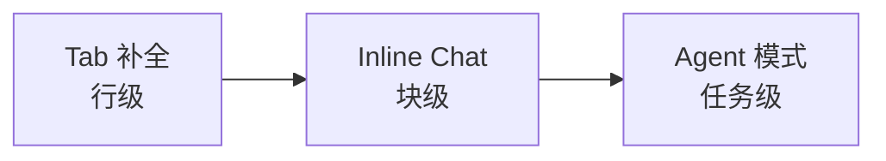
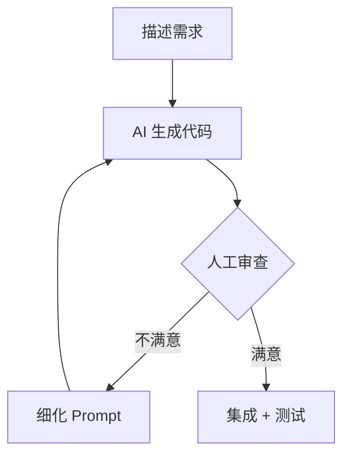

# Vibe Coding 与 AI 辅助开发

> 你不再逐行写代码，而是用自然语言告诉 AI"我要什么"——这就是 Vibe Coding，一场正在重塑软件开发方式的范式转移。

传统编码像手动挡开车，你控制每一个细节——变量命名、循环边界、异常处理。Vibe Coding 像自动驾驶，你说目的地，AI 帮你规划路线和操作方向盘。但区别在于：你仍然是那个负责判断路况的驾驶员，AI 生成的每一行代码都需要你审查把关。

上一篇我们理解了 [LLM 的底层原理](/llm-agent/llm-fundamentals)——Transformer、注意力机制、训练流程。这一篇聚焦于如何将这些模型变成你的编程搭档。对于 iOS 开发者来说，"熟练使用 AI 辅助开发"已经是简历上的加分项，面试中也越来越多地涉及相关问题。掌握这些工具不是可选项，而是必备技能。

## Vibe Coding 的定义与起源

**Vibe Coding** 这个词由 Andrej Karpathy（OpenAI 联合创始人、前 Tesla AI 总监）在 2025 年 2 月提出。他的原话是：

> "You just see things, say things, run things, and copy-paste things, and it mostly works."

简单说：你用自然语言描述想要什么，AI 生成代码，你负责审查和引导方向。开发者的角色从"写代码的人"变成了"审代码的人"。

| 对比项 | 传统编码 | 低代码平台 | Vibe Coding |
|--------|---------|-----------|-------------|
| 输入方式 | 手写代码 | 拖拽组件 | 自然语言 |
| 控制粒度 | 逐行控制 | 模块级 | 意图级 |
| 灵活性上限 | 无限 | 受限于平台 | 取决于 LLM + 审查能力 |
| 适用场景 | 全生命周期 | 快速原型 | 原型 + 中等复杂度功能 |
| 学习门槛 | 高 | 低 | 中（需要编程基础） |

::: tip Vibe Coding 不等于"不用懂代码"
Karpathy 自己是 AI 领域顶级专家，能判断生成结果的对错。底层功底越扎实，使用 AI 工具的上限越高。面试官看到简历上写"擅长 AI 辅助开发"时，验证的不是你会不会用工具，而是你能不能判断 AI 输出的好坏。
:::

## AI 编程工具全景

当前 AI 编程工具可以分为三大类：

- **IDE 内嵌型**：直接集成到编辑器中，写代码时实时辅助。代表：Cursor、GitHub Copilot、Windsurf
- **CLI 型**：在终端运行的 Agent，适合大规模操作。代表：Claude Code、Aider
- **Cloud 型**：浏览器中生成完整项目，适合快速原型。代表：v0、bolt.new、Replit Agent

| 工具 | 类型 | 背后模型 | 核心能力 | 适合场景 |
|------|------|---------|---------|---------|
| Cursor | AI IDE | Claude / GPT / 自研 | Tab 补全 + Agent 模式 | 日常开发全场景 |
| GitHub Copilot | IDE 插件 | GPT-4o / Claude | 行级补全 + Chat | 已有 VS Code 用户 |
| Windsurf | AI IDE | Claude / GPT | Cascade 多步骤 Agent | 类 Cursor 替代 |
| Claude Code | CLI Agent | Claude Sonnet / Opus | 终端操作 + 多文件重构 | 大规模重构、CI/CD |
| Aider | CLI | 多模型支持 | Git 感知的代码编辑 | 命令行偏好者 |
| v0 / bolt.new | Cloud | 多模型 | 前端 UI 一键生成 | 快速原型验证 |

::: warning 工具更新极快
AI 编程工具的迭代速度以周为单位，功能和定价频繁变化。本文信息以 2025 年为基准，具体功能请以官方文档为准。
:::

## 三种交互模式：补全、对话与 Agent

不管用哪个工具，AI 辅助编程的交互模式本质上就三种，控制粒度从细到粗：



**Tab 补全**：最轻量的方式。你正常写代码，AI 实时预测接下来几行，按 Tab 接受。类比 iPhone 键盘的联想输入——你打几个字，它猜你想说什么。

**Inline Chat（Cmd+K）**：选中一段代码，用自然语言告诉 AI 怎么改。比如选中一个回调函数，输入"重构为 async/await"。类比指着屏幕说"这里帮我改一下"。

**Agent 模式**：给出一个高层目标（如"实现用户登录模块"），AI 自主规划步骤、创建文件、跨文件修改、执行终端命令。类比交给一个初级工程师处理整个 task——你需要事后 review。

| 维度 | Tab 补全 | Inline Chat | Agent 模式 |
|------|---------|-------------|-----------|
| 触发方式 | 自动 / Tab | 选中代码 + 指令 | 描述任务目标 |
| 修改范围 | 1-3 行 | 单文件局部 | 跨文件 |
| 人类控制 | 逐行接受 | 逐次确认 | 事后审查 |
| 风险等级 | 极低 | 低 | 中 |
| 典型用途 | 补全函数体 | 重构单个方法 | 实现完整功能 |

## Cursor 核心概念

Cursor 是目前最流行的 AI IDE，基于 VS Code 二次开发，内置了上述三种交互模式。

### Tab 补全

Cursor Tab 不只是单行补全——它能预测你接下来要改的多个位置，支持**光标跳转预测**。比如你改了一个参数名，它会自动建议修改所有引用该参数的地方。

### Cmd+K（内联编辑）

选中代码 + 自然语言指令 = 局部精准修改。适合重构单个函数、修复特定 bug、添加错误处理。

### Composer / Agent 模式

多文件编辑模式。你描述一个任务，Cursor 自动创建 / 修改多个文件，还能执行终端命令、调用 MCP 工具。

### 上下文管理

Cursor 的核心竞争力之一是灵活的上下文管理——通过 `@` 符号指定 AI 能看到什么：

| 上下文符号 | 作用 | 使用示例 |
|-----------|------|---------|
| `@files` | 引用指定文件 | `@NetworkManager.swift 重构错误处理` |
| `@folder` | 引用整个目录 | `@Models/ 检查所有 Codable 实现` |
| `@docs` | 引用外部文档 | `@Apple-URLSession 如何实现后台下载` |
| `@web` | 实时搜索 | `@web SwiftUI NavigationStack iOS 17 变化` |
| `@codebase` | 全局语义搜索 | `@codebase 哪些地方调用了这个 API` |

### .cursorrules 项目规则

`.cursorrules` 是 Cursor 的项目级 AI 行为规则文件，相当于给 AI 一份"新人入职须知"。团队协作时应提交到 Git：

```
# .cursorrules

你是一个资深 iOS 开发者。

## 技术栈
- Swift 5.9+, SwiftUI, iOS 17+
- 架构：MVVM + Coordinator
- 网络：URLSession + async/await
- 数据：SwiftData

## 代码规范
- 使用 guard let 替代 if let 做早返回
- 错误处理使用 Swift typed throws
- 所有公开 API 必须有文档注释
- 视图层不直接调用网络请求
```

::: tip .cursorrules 是项目知识的沉淀
把代码规范、架构约定、常用 pattern 写进 `.cursorrules`，AI 生成的代码就会自动遵循你的团队风格。这不是"可选配置"，而是提升 AI 输出质量最有效的手段。
:::

## Claude Code 核心概念

Claude Code 是 Anthropic 推出的 CLI Agent，和 Cursor 的最大区别是：它不在 IDE 里，而是在终端运行。你用自然语言下达指令，它自主读取文件、搜索代码、执行命令、修改多个文件。


### CLAUDE.md 项目记忆

类似 Cursor 的 `.cursorrules`，Claude Code 用 `CLAUDE.md` 文件存储项目上下文。它支持分层——根目录放全局规则，子目录放模块特定规则：

```markdown
# CLAUDE.md

## 项目概述
iOS 电商 App，SwiftUI + MVVM 架构。

## 构建与测试
- 构建: xcodebuild -scheme MyApp -sdk iphonesimulator
- 测试: swift test
- Lint: swiftlint

## 代码规范
- Commit message 使用中文
- PR 必须包含单元测试
- 网络层使用 async/await
```

### Hooks 与 MCP

- **Hooks**：在工具调用的生命周期节点（如执行命令前 / 后）执行自定义脚本，实现自动化工作流
- **MCP（Model Context Protocol）**：通过标准协议扩展 AI 的工具能力——连接数据库、调用 API、操作外部服务。详见后续 [MCP 协议与工具生态](/llm-agent/mcp) 专篇

### Cursor vs Claude Code

| 维度 | Cursor | Claude Code |
|------|--------|-------------|
| 交互方式 | GUI（IDE 内） | CLI（终端） |
| 上下文获取 | @符号手动指定 | 自动搜索整个代码库 |
| 多文件编辑 | Composer / Agent | 默认支持 |
| 项目规则 | `.cursorrules` | `CLAUDE.md` |
| 扩展能力 | MCP | MCP + Hooks |
| 最佳场景 | 日常编码、UI 开发 | 大规模重构、CI/CD 集成 |
| 学习曲线 | 低（GUI 直觉） | 中（需要终端经验） |

## AI 辅助开发工作流

不管用哪个工具，高效的 AI 辅助开发都遵循同一个循环：



一个实际的 iOS 开发场景——用 AI 实现网络请求模块：

**第 1 轮 Prompt**：
> 在 NetworkManager 中添加一个通用的请求方法：使用 async/await，支持泛型 Decodable 返回值，统一错误处理（网络错误、解码错误、HTTP 状态码错误），加上请求超时配置。

**审查发现问题**：AI 没有处理 401 未授权的 token 刷新逻辑。

**第 2 轮 Prompt**：
> 补充 401 处理：收到 401 时自动刷新 token 并重试一次，如果仍然 401 则跳转登录页。

**审查通过**：合并代码，补充单元测试。

::: warning 不要把 AI 生成的代码直接合并
AI 生成的代码可能包含过时 API、安全漏洞或逻辑错误。每一段 AI 生成的代码都必须经过人工审查——这不是"可选步骤"而是**必须步骤**。
:::

## 代码场景 Prompt 实战

写好 Prompt 是提升 AI 编码效率的关键。针对开发中的四种核心场景，Prompt 的要点各有侧重：

| 场景 | Prompt 关键要素 | 示例指令 |
|------|---------------|---------|
| 代码生成 | 功能描述 + 技术栈 + 规范约束 | "用 Swift async/await 实现图片缓存，支持内存 + 磁盘双层缓存，LRU 淘汰策略" |
| 代码重构 | 当前问题 + 目标状态 + 接口约束 | "将这个回调嵌套重构为 async/await，保持公开接口不变" |
| 代码审查 | 审查维度 + 严重级别 | "审查这段网络请求代码的安全性和错误处理，按严重/中等/轻微分级" |
| 单测生成 | 被测对象 + 覆盖场景 + 框架 | "为 LoginViewModel 生成单测，覆盖成功/失败/超时三种场景，使用 Swift Testing" |

**好 Prompt 的结构**：角色设定 + 技术约束 + 输入输出规格 + 示例。越具体，AI 输出越精准。

**差 Prompt**："帮我写个网络请求"——太模糊，AI 不知道你用什么框架、什么错误处理策略。

**好 Prompt**："用 URLSession + async/await 封装一个通用网络请求方法，入参是 URLRequest，返回泛型 Decodable，错误用自定义 NetworkError 枚举，包含 invalidURL / serverError(Int) / decodingFailed 三种 case"——具体到 AI 可以直接生成可用代码。

::: tip 与 Prompt Engineering 的关系
本节只覆盖"如何写好代码相关的 Prompt"。通用的提示词工程技巧（Few-shot、CoT 思维链、提示词攻防等）将在 [Prompt Engineering](/llm-agent/prompt-engineering) 中详细展开。
:::

## AI 辅助开发的边界与风险

AI 不是万能的。了解它的边界，才能避免踩坑：

| 风险类型 | 严重程度 | 典型表现 | 应对策略 |
|---------|---------|---------|---------|
| 幻觉 API | 高 | 调用不存在的方法或框架 | 编译验证 + 文档核查 |
| 安全漏洞 | 高 | 硬编码 secret、明文存储 | 安全审查 checklist |
| 过时代码 | 中 | 使用 deprecated API | 在 Prompt 中指定 SDK 版本 |
| 逻辑错误 | 中 | 边界条件遗漏 | 单测覆盖边界用例 |
| 风格不一致 | 低 | 命名/结构不符合团队规范 | .cursorrules / CLAUDE.md |

::: danger AI 生成代码的安全红线
以下类型的代码**必须人工逐行审查**，不能盲目信任 AI：
- 网络请求：HTTPS 配置、证书验证
- 数据存储：Keychain vs UserDefaults 的选择
- 权限管理：相机、位置、通知等权限请求
- 第三方 SDK：初始化配置、数据上报

永远不要让 AI 处理 API Key、密钥和凭证——这些应该走环境变量或密钥管理服务。
:::

## AI 对开发者能力模型的影响

AI 工具正在重新定义"什么是有价值的开发技能"：

| 能力 | AI 前 | AI 后 | 变化 |
|------|------|------|------|
| 语法记忆 | 日常技能 | AI 代劳 | 大幅贬值 |
| API 查阅 | 重要 | AI 即查即用 | 部分替代 |
| 模板代码 | 耗时必做 | AI 秒生成 | 完全替代 |
| 架构设计 | 高级技能 | 核心竞争力 | 升值 |
| 代码审查 | 软技能 | 必备硬技能 | 大幅升值 |
| 调试能力 | 重要 | 不可替代 | 升值 |
| 需求理解 | 重要 | 更加关键 | 升值 |
| Prompt 能力 | 不存在 | 新必备技能 | 新增 |

趋势很明确：**"写代码"的价值在下降，"判断代码好坏"和"做对的设计决策"的价值在上升**。

::: tip 面试信号
简历上写"熟练使用 AI 辅助开发"时，面试官想验证的不是你会不会用 Cursor，而是你能不能判断 AI 生成代码的好坏、能不能在 AI 犯错时自己接手。底层功底才是真正的区分度。
:::

## 面试高频问题

### Q1: 什么是 Vibe Coding？它和传统编程有什么区别？⭐

**答题思路**：
1. Andrej Karpathy 2025 年提出的概念：用自然语言描述意图，让 AI 生成代码，开发者负责审查
2. 核心区别：从"写代码"到"审代码"，开发者角色从"实现者"变成"架构师 + 审查者"
3. 不等于"不用懂代码"——需要足够的技术能力来判断 AI 输出的正确性
4. 加分：提到对软件工程的影响——代码审查能力和架构设计能力变得更重要

### Q2: Cursor 和 Claude Code 的核心区别是什么？各适合什么场景？⭐⭐

**答题思路**：
1. Cursor 是 AI IDE（GUI），适合日常开发；Claude Code 是 CLI Agent，适合大规模重构和 CI/CD 集成
2. 上下文机制不同：Cursor 通过 @符号手动指定，Claude Code 自动搜索代码库
3. Cursor 有 Tab 补全 + Inline Chat + Agent 三种模式；Claude Code 全程 Agent 模式
4. 加分：两者都支持 MCP 协议扩展工具能力，都支持项目级规则文件（.cursorrules / CLAUDE.md）

### Q3: 如何用 AI 工具进行代码审查和重构？⭐⭐

**答题思路**：
1. 审查：给 AI 明确的审查维度（安全性、性能、可维护性），让它按严重级别列出问题清单
2. 重构：明确"保持接口不变"约束，让 AI 分步重构而非一次性大改
3. 关键原则：AI 审查是辅助而非替代，最终决策权在人
4. 加分：提到用 .cursorrules / CLAUDE.md 预设代码规范，从源头减少风格问题

### Q4: AI 生成代码的主要风险有哪些？如何应对？⭐⭐⭐

**答题思路**：
1. 幻觉：编造不存在的 API 或方法，应对方式是编译验证 + 文档核查
2. 安全漏洞：硬编码密钥、不安全的数据存储，应对方式是安全审查 checklist
3. 上下文丢失：大项目中 AI 可能遗漏关键依赖，应对方式是用 @files / @codebase 主动提供上下文
4. 加分：强调"AI 生成的代码 = 你的代码"——出了 bug 是开发者的责任，不能推给工具

### Q5: 在你的项目中，你是如何使用 AI 辅助开发的？⭐⭐⭐

**答题思路**：
1. 代码生成：描述功能需求，AI 生成初始实现，然后人工调整细节和边界条件
2. 重构：选中旧代码 + 指令（如"重构为 async/await"），AI 完成后审查兼容性
3. 代码审查：提交前让 AI 做初步审查，检查内存泄漏、线程安全、API 使用等常见问题
4. 单测生成：给出被测类和期望场景，AI 生成测试用例框架，人工补充边界条件
5. 加分：强调"AI 是效率工具而非替代品"，展示你对生成代码质量的把控能力

## 一张表回顾

| 知识点 | 核心要义 | 掌握程度 |
|--------|---------|---------|
| Vibe Coding | 自然语言驱动开发，Karpathy 2025 年提出 | ⭐⭐⭐ 必须 |
| 三种交互模式 | Tab 补全（行级）→ Inline Chat（块级）→ Agent（任务级） | ⭐⭐⭐ 必须 |
| Cursor | AI IDE，@上下文、.cursorrules、Composer/Agent | ⭐⭐⭐ 必须 |
| Claude Code | CLI Agent，CLAUDE.md、Hooks、MCP 集成 | ⭐⭐ 理解 |
| 开发工作流 | 描述 → 生成 → 审查 → 迭代 → 测试 | ⭐⭐⭐ 必须 |
| Prompt 实战 | 角色 + 约束 + 规格 + 示例，四大场景 | ⭐⭐ 理解 |
| 风险与边界 | 幻觉、安全漏洞、过时 API、过度依赖 | ⭐⭐⭐ 必须 |
| 能力模型变化 | 架构 / 审查 / 调试升值，语法记忆 / API 查阅贬值 | ⭐⭐ 理解 |
