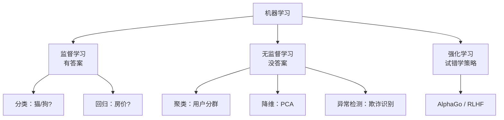
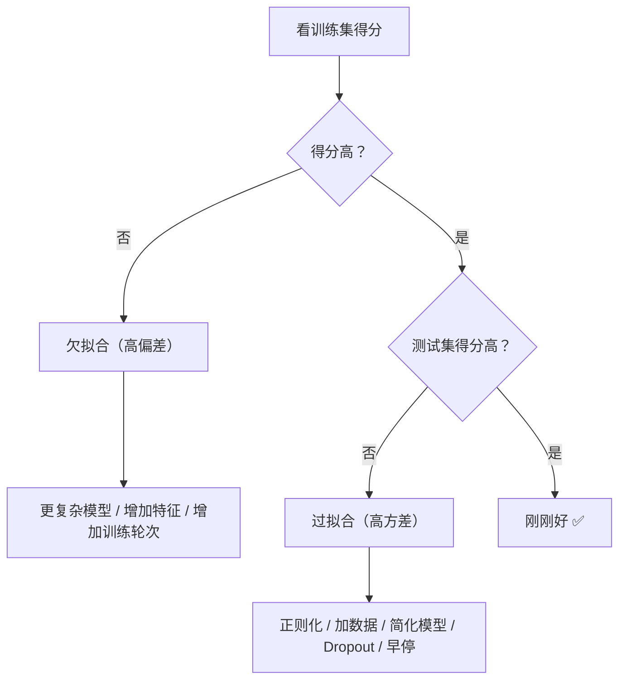

# 机器学习基础

> 在学具体算法之前，先搞清楚机器学习的全貌——什么是 ML、有哪几种、怎么训练、怎么评估、什么叫过拟合。这些概念贯穿所有后续章节。

**机器学习 = 让计算机从数据中自动学习规律，而不是手动编写规则。** 传统编程是"人写规则"，ML 是"数据生成规则"。类比：传统编程 ≈ 你手写 AutoLayout 约束，每种屏幕尺寸都要手动适配；机器学习 ≈ 你给几个示例布局，系统自动推断出约束关系，新屏幕尺寸也能适配。

ML 基础概念（过拟合、评估指标、偏差方差）是算法岗和客户端 AI 岗的必考内容，也是后续监督学习、集成学习、深度学习的认知基座。

::: warning 常见误区
"深度学习取代了机器学习"是错的。Kaggle 竞赛中表格数据的冠军方案绝大多数使用 XGBoost / LightGBM 等传统树模型。深度学习擅长非结构化数据（图像、文本），但结构化数据上传统 ML 仍然是首选。
:::

## 传统编程 vs 机器学习

| 方式 | 输入 | 过程 | 输出 |
|------|------|------|------|
| 传统编程 | 人写规则 + 数据 | 程序执行 | 结果 |
| 机器学习 | 数据 + 结果/标签 | 模型学习 | 规则/模型 |

传统编程实现"照片搜索"，你得写 `if 图片包含蓝天 && 图片包含沙滩 → 标记为"海边"`……规则写不完，新场景就废了。机器学习方式：给模型看 10000 张已标注的照片，模型自动学会识别场景，新照片也能正确分类，因为它学到了规律而非死记规则。

## 三大学习类型

### 监督学习（Supervised Learning）——最常用

有**标签**（正确答案）的数据，学习输入到输出的映射。比如给模型看大量已标注的图片——图片 1 → 标签"猫"、图片 2 → 标签"狗"——模型学会后，给新图片也能判断是猫还是狗。

监督学习分两种任务：

| 任务 | 输出 | 例子 |
|------|------|------|
| **分类** | 离散类别（几选一） | 图片→猫/狗、邮件→垃圾/正常 |
| **回归** | 连续数值 | 房屋特征→房价、气温预测 |

怎么区分？**"这是猫还是狗？"** → 分类（答案是有限的类别）；**"这套房子值多少钱？"** → 回归（答案是一个连续数字）。

### 无监督学习（Unsupervised Learning）

没有标签，让模型**自己发现**数据中的结构和模式。类比：监督学习 ≈ 老师给标准答案让你学，无监督学习 ≈ 没有老师，你自己把相似的东西分成几堆。

| 任务 | 说明 | 例子 |
|------|------|------|
| **聚类** | 将相似数据分组 | 电商用户分群（高消费/低消费/新用户） |
| **降维** | 压缩特征维度 | PCA 把 100 维数据压到 2 维来可视化 |
| **异常检测** | 找出异常数据 | 信用卡欺诈检测 |

### 强化学习（Reinforcement Learning）

Agent（智能体）通过与环境交互、获得奖励来学习策略。类比训练小狗：小狗坐下 → 给零食（奖励）→ 学会"坐下"；小狗咬沙发 → 被训斥（惩罚）→ 学会"不咬沙发"。通过不断试错和反馈，逐渐学到最优策略。

> AlphaGo（下围棋）、ChatGPT 的 RLHF（用人类反馈做强化学习）都属于强化学习。

### 三种类型一图总结

::: warning 学习类型 ≠ 模型类型
监督 / 无监督 / 强化学习是按**有无标签**划分的**学习范式**；传统 ML / 深度学习是按**模型复杂度**划分的**模型类型**。两者是交叉关系，不是包含关系：

| | 监督学习 | 无监督学习 |
|------|---------|----------|
| **传统 ML** | 线性回归、决策树、SVM | K-Means 聚类、PCA 降维 |
| **深度学习** | 图像分类（CNN）、文本分类（BERT） | 自编码器、GAN |

比如用带标签的图片训练 CNN 做分类，这既是监督学习，也是深度学习。
:::

## ML vs DL：何时用哪个

| 场景 | 推荐 | 原因 |
|------|------|------|
| 表格/结构化数据 | 传统 ML（XGBoost） | 效果好、训练快 |
| 小数据量（< 1000） | 传统 ML | 深度学习容易过拟合 |
| 图像、文本、语音 | 深度学习 | 自动特征提取优势大 |
| 需要可解释性 | 传统 ML（决策树） | 深度学习是黑盒 |
| 计算资源有限 | 传统 ML | 无需 GPU |

## 机器学习工作流程

一个完整的 ML 项目从头到尾是这样的：

1. **定义问题** → 分类？回归？要预测什么？
2. **收集数据** → 数据从哪来？够不够？质量怎么样？
3. **数据预处理** → 清洗、缺失值处理、特征工程
4. **划分数据集** → 训练集 / 验证集 / 测试集
5. **选择模型** → 线性回归？决策树？XGBoost？
6. **训练模型** → 模型在训练集上学习规律
7. **评估与调参** → 在验证集上评估，调整超参数
8. **最终评估** → 在测试集上一次性评估，得到最终成绩
9. **部署上线** → 模型服务化 / 端侧部署

## 过拟合与欠拟合

这是 ML 中最核心的概念之一，面试必考。

### 过拟合（Overfitting）

模型把训练数据**背下来了**，但遇到新数据就不行了。

**类比**：学生把往年真题的答案全背了，换个题目就不会做。训练集 100 分，测试集 60 分——差距很大，就是过拟合。

### 欠拟合（Underfitting）

模型**连训练数据都没学好**，太简单了。

**类比**：学生只学了加减法，让他解方程完全不会。训练集 60 分，测试集 55 分——两个都低，就是欠拟合。

### 怎么判断和解决

| 问题 | 解决方法 | 一句话解释 |
|------|---------|-----------|
| **过拟合** | 增加数据量 | 见的题多了就不会死记硬背 |
| | 正则化（L1/L2） | 给参数加约束，不让它们太"自由" |
| | Dropout | 训练时随机关掉一些神经元，防止依赖特定特征 |
| | 早停（Early Stopping） | 验证集得分开始下降时停止训练 |
| | 数据增强（Data Augmentation） | 翻转、裁剪、变色，一张图变五张 |
| **欠拟合** | 用更复杂的模型 | 线性模型学不了复杂规律，换深度网络 |
| | 增加训练轮次 | 没学够，多学几轮 |
| | 添加更多特征 | 给模型更多信息来做判断 |

## 偏差与方差

### 射箭类比

- **偏差（Bias）**= 箭整体偏离靶心的程度。高偏差 = 瞄准方向本身就歪了，对应**欠拟合**
- **方差（Variance）**= 箭之间散布的程度。高方差 = 每次射出去位置差很远，对应**过拟合**

| 情况 | 特征 | 状态 |
|------|------|------|
| 低偏差 + 低方差 | 集中且准确 ✅ | 理想状态 |
| 低偏差 + 高方差 | 中心准但散 | 过拟合 |
| 高偏差 + 低方差 | 集中但偏了 | 欠拟合 |
| 高偏差 + 高方差 | 又散又偏 | 最差 |

### 偏差-方差权衡

- 模型太简单 → 高偏差 → 训练集和测试集都差
- 模型太复杂 → 高方差 → 训练集好但测试集差
- 目标：找到中间的**甜蜜点**

## 数据集划分

### 三种数据集

| 数据集 | 用途 | 占比 | 类比 |
|--------|------|------|------|
| **训练集** | 模型学习用 | 70-80% | 往年真题 |
| **验证集** | 调参、选模型 | 10-15% | 模拟考试（可以考很多次） |
| **测试集** | 最终评估（只用一次） | 10-15% | 正式高考（只考一次） |

**为什么需要验证集和测试集两个？** 如果你不停地根据模拟考调整学习方法，你的成绩可能只是"对模拟考题型很熟"，不代表真正学会了。所以需要一套从没见过的题（测试集）做最终判断。

### 交叉验证

数据量小的时候，随机划分一次可能不公平。K 折交叉验证**轮流当验证集**：

| 轮次 | 第 1 份 | 第 2 份 | 第 3 份 | 第 4 份 | 第 5 份 | 得分 |
|------|---------|---------|---------|---------|---------|------|
| 第 1 轮 | **验证** | 训练 | 训练 | 训练 | 训练 | 90% |
| 第 2 轮 | 训练 | **验证** | 训练 | 训练 | 训练 | 88% |
| 第 3 轮 | 训练 | 训练 | **验证** | 训练 | 训练 | 91% |
| 第 4 轮 | 训练 | 训练 | 训练 | **验证** | 训练 | 89% |
| 第 5 轮 | 训练 | 训练 | 训练 | 训练 | **验证** | 92% |

最终得分 = 平均值 = **90%**。好处：每条数据都当过验证集，结果更可靠。代价：训练 K 次，耗时 ×K。

### 超参数

**超参数** = 人工设定的参数，模型自己学不了，需要你来决定。

| 超参数 | 含义 | 类比 |
|--------|------|------|
| 学习率（lr） | 每次更新参数的步长 | 下山时每步走多远 |
| batch size | 每次喂给模型多少样本 | 一次看几道练习题 |
| epoch 数 | 训练数据过几轮 | 课本翻几遍 |
| 模型复杂度 | 网络层数 / 树的深度 | 大脑有多少神经元 |

调参方法：在**验证集**上试不同值，选效果最好的。注意：绝不能用测试集调参！

## 正则化

> 防止过拟合的核心手段——给模型加约束，不让它太"自由"。

### L1 正则化（Lasso）

在 loss 中加上参数**绝对值之和**：

$$\text{Loss} = \text{原始Loss} + \lambda \sum |w_i|$$

特点：会让一些参数变成 0 → 自动丢弃无用特征 → 起到**特征选择**的效果。

### L2 正则化（Ridge / Weight Decay）

在 loss 中加上参数**平方和**：

$$\text{Loss} = \text{原始Loss} + \lambda \sum w_i^2$$

特点：让所有参数趋向更小但不会变成 0 → 模型更平滑，不会过度依赖某些特征。

### L1 vs L2 对比

| 特性 | L1 (Lasso) | L2 (Ridge) |
|------|-----------|-----------|
| 惩罚方式 | 绝对值之和 | 平方和 |
| 参数效果 | 部分变为 0（稀疏） | 都缩小但不为 0 |
| 特征选择 | 有，自动筛选特征 | 无 |
| 适用场景 | 特征多且有冗余 | 大部分场景通用 |

### Dropout

训练时随机"关掉"一部分神经元（通常 20%-50%），让模型不依赖某几个特征。

**类比**：团队合作中，如果每次都是同一个人做核心工作，这个人一请假团队就瘫了。Dropout = 每次随机让一些人请假，逼迫每个人都能独当一面。推理时不做 Dropout，但需要对输出做缩放以保持一致性。

## 评估指标

### 分类任务

**混淆矩阵**——以垃圾邮件检测为例（阳性 = 垃圾邮件）：

| | 实际是垃圾邮件 | 实际是正常邮件 |
|------|---------------|---------------|
| **模型说"是垃圾"** | TP（真阳性）说对了 ✅ | FP（假阳性）冤枉好人 ❌ |
| **模型说"不是垃圾"** | FN（假阴性）漏网之鱼 ❌ | TN（真阴性）说对了 ✅ |

**记忆**：T/F = 判断对/错，P/N = 模型说"是/否"。

**准确率（Accuracy）**：

$$\text{Accuracy} = \frac{TP + TN}{\text{总数}}$$

::: danger 准确率的陷阱
1000 封邮件中 990 封正常、10 封垃圾，模型什么都不做全判"正常"→ 准确率 99%，但一封垃圾都没抓到！数据不平衡时，准确率会严重误导你。
:::

**精确率（Precision）与召回率（Recall）**：

- **精确率** $= \frac{TP}{TP + FP}$ → 模型说"是"的里面，有多少真的是？（关注**误报**）
- **召回率** $= \frac{TP}{TP + FN}$ → 实际为"是"的里面，模型抓到了多少？（关注**漏报**）

不同场景侧重不同：

| 场景 | 侧重 | 原因 |
|------|------|------|
| 垃圾邮件 | **精确率** | 别把正常邮件标成垃圾（别冤枉好人） |
| 癌症筛查 | **召回率** | 别漏掉一个患者（别放过坏人） |

**F1 分数**——精确率和召回率的调和平均：

$$F1 = \frac{2 \times Precision \times Recall}{Precision + Recall}$$

特点：如果 Precision 或 Recall 任一个很低，F1 也会很低。例子：$Precision=100\%$，$Recall=1\%$ → 普通平均 = 50.5%（看似还行），$F1 \approx 2\%$（揭示真实水平）。

**AUC-ROC**：ROC 曲线展示"抓坏人能力"和"冤枉好人代价"的关系，AUC = 曲线下面积。AUC = 1.0 完美，0.5 等于瞎猜，> 0.8 通常认为不错。数据不平衡时比准确率更靠谱。

### 回归任务

| 指标 | 含义 | 特点 |
|------|------|------|
| **MAE** | 平均绝对误差 | 直观，平均偏差多少 |
| **MSE** | 均方误差 | 放大大误差，惩罚离谱预测 |
| **RMSE** | MSE 开根号 | 和原始数据同单位，更好理解 |

以真实值 `[100, 200, 300]`、预测值 `[110, 190, 280]`、误差 `[10, -10, -20]` 为例：

$$MAE = \frac{10+10+20}{3} \approx 13.3 \text{ 万}$$

$$MSE = \frac{100+100+400}{3} = 200$$

$$RMSE = \sqrt{200} \approx 14.1 \text{ 万}$$

## 面试高频问题

### Q1: 什么是机器学习？和传统编程有什么区别？⭐

**答题思路**：
1. 一句话定义：从数据中自动学习规律，而非手动编写规则
2. 核心区别：规则的来源不同——人写的 vs 数据中学的
3. 举例：传统编程写 `if 蓝天 && 沙滩 → 海边`，ML 给 10000 张标注照片让模型自己学

### Q2: 监督学习、无监督学习、强化学习的区别？⭐⭐

**答题思路**：
1. **监督学习**：有标签，学输入→输出映射（分类、回归）——最常用
2. **无监督学习**：无标签，发现数据结构（聚类、降维、异常检测）
3. **强化学习**：Agent 与环境交互，通过奖惩学策略（AlphaGo、RLHF）
4. 加分：举一个每种类型的实际应用场景

### Q3: 过拟合和欠拟合是什么？怎么解决？⭐⭐⭐

**答题思路**：
1. **过拟合**：训练集好但测试集差，模型"背答案"
2. **欠拟合**：两个都差，模型太简单
3. 解决过拟合：正则化（L1/L2）、Dropout、增加数据、早停、数据增强
4. 解决欠拟合：更复杂模型、更多特征、更多训练轮次
5. 加分：用偏差-方差的角度解释——过拟合=高方差，欠拟合=高偏差

### Q4: 精确率和召回率的区别？什么场景侧重哪个？⭐⭐⭐

**答题思路**：
1. 精确率：模型说"是"的里面，真的是的比例（关注**误报**）
2. 召回率：实际为"是"的里面，模型抓到的比例（关注**漏报**）
3. 场景举例：垃圾邮件看精确率（别冤枉好邮件），癌症筛查看召回率（别漏掉患者）
4. 加分：提 F1 分数作为综合指标，解释调和平均的意义

### Q5: 为什么需要训练集、验证集、测试集三个？⭐⭐

**答题思路**：
1. 训练集用于学习，验证集用于调参选模型，测试集用于最终评估
2. 验证集可以反复使用但会间接影响模型（信息泄漏风险）
3. 测试集保证公正——只用一次，模型从未见过
4. 类比：往年真题（训练）→ 模拟考（验证）→ 正式高考（测试）

### Q6: L1 和 L2 正则化的区别？⭐⭐

**答题思路**：
1. L1 惩罚参数绝对值之和 → 部分参数变为 0 → **特征选择**效果
2. L2 惩罚参数平方和 → 所有参数缩小但不为 0 → 模型更**平滑**
3. L1 适合高维稀疏场景，L2 更通用
4. 加分：PyTorch 中 L2 正则化通常通过 `weight_decay` 参数实现

### Q7: 准确率为什么不够用？什么时候用 AUC？⭐⭐

**答题思路**：
1. 准确率在数据不平衡时会误导：99% 正样本全判正也有 99% 准确率
2. AUC 不受类别分布和阈值选择影响
3. 适用场景：二分类、数据不平衡、需要比较不同模型
4. AUC > 0.8 通常认为不错，= 0.5 等于瞎猜

## 一张表回顾

| 知识点 | 核心要义 | 掌握程度 |
|--------|---------|---------|
| 什么是机器学习 | 从数据中自动学规则，不手写规则 | ⭐⭐⭐ 必须 |
| 三大学习类型 | 监督（有标签）/ 无监督（没标签）/ 强化（试错学策略） | ⭐⭐⭐ 必须 |
| 分类 vs 回归 | 离散类别 vs 连续数值 | ⭐⭐⭐ 必须 |
| ML vs DL 选型 | 结构化数据用 ML，图像文本用 DL | ⭐⭐ 理解 |
| 过拟合 vs 欠拟合 | 背答案 vs 太简单，最核心的概念 | ⭐⭐⭐ 必须 |
| 偏差 vs 方差 | 瞄不准 vs 太分散，权衡是关键 | ⭐⭐ 理解 |
| 数据集划分 | 训练 / 验证 / 测试，三者各有分工 | ⭐⭐⭐ 必须 |
| 正则化 L1 / L2 | 约束参数防过拟合，L1 稀疏 L2 平滑 | ⭐⭐ 理解 |
| Dropout | 随机关神经元，防依赖特定特征 | ⭐⭐ 理解 |
| 精确率 vs 召回率 | 误报 vs 漏报，场景决定侧重 | ⭐⭐⭐ 必须 |
| F1 / AUC-ROC | 综合评估指标，不平衡数据看 AUC | ⭐⭐ 理解 |
| 交叉验证 | 轮流当验证集，小数据更可靠 | ⭐ 了解 |
| 超参数 | 人工设定，在验证集上调 | ⭐⭐ 理解 |
