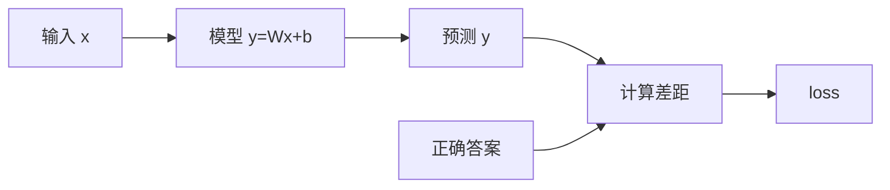

# 数学基础

> 只讲机器学习和深度学习**真正用到**的数学，不追求证明，重在直觉理解。掌握这些，看论文不心虚，面试不露怯。

数学是 ML/DL 的"语言"。你不需要成为数学家，但需要能读懂这门语言。就像开车不需要会造发动机，但得知道油门、刹车和方向盘的原理。

## 标量、向量、矩阵、张量

> 数据的容器——从一个数到任意维度数组。

### 标量（Scalar）—— 一个数

就是一个普通的数字，是最简单的数据形式。比如温度 `36.5`、学习率 `0.001`、损失值 `0.023`。

### 向量（Vector）—— 一组数

多个数字排成一行（或一列），就是向量。**"维"就是这个列表有几个数字。**

- 一个学生的成绩：`[语文85, 数学92, 英语78]` → 3 维向量
- 一个像素的颜色：`[R=255, G=128, B=0]` → 3 维向量

**类比**：向量就像一份简历上的多项评分——单看一个数字信息太少，一组数字合在一起才能描述一个完整的"东西"。

### 矩阵（Matrix）—— 一张表格

多个向量排在一起就是矩阵，可以理解为二维表格。比如三个学生的成绩：

| | 语文 | 数学 | 英语 |
|------|------|------|------|
| 学生 A | 85 | 92 | 78 |
| 学生 B | 90 | 88 | 95 |
| 学生 C | 76 | 81 | 89 |

这就是一个 **3×3 矩阵**（3 行 3 列）。在 ML 中最常见的用途：**每行是一个样本，每列是一个特征**。

### 张量（Tensor）—— 多维数组

标量、向量、矩阵都是张量的特例。张量就是**任意维度的数组**：

| 类型 | 维度 | 示例 |
|------|------|------|
| 标量 | 0 维张量 | `loss = 0.5` |
| 向量 | 1 维张量 | `[1, 2, 3]` |
| 矩阵 | 2 维张量 | `[[1,2],[3,4]]` |
| 3 维张量 | 3 维 | 一张彩色图片 `(3, 224, 224)` = 通道×高×宽 |
| 4 维张量 | 4 维 | 一批彩色图片 `(32, 3, 224, 224)` = 批次×通道×高×宽 |

```python
import torch

s = torch.tensor(3.14)                   # 标量 → shape: []
v = torch.tensor([1.0, 2.0, 3.0])       # 向量 → shape: [3]
m = torch.tensor([[1, 2], [3, 4]])       # 矩阵 → shape: [2, 2]
batch = torch.randn(32, 3, 224, 224)     # 一批彩色图 → shape: [32, 3, 224, 224]
```

::: tip 为什么深度学习用张量
1. **GPU 擅长并行计算**：一次处理整个张量比逐个处理快几百倍
2. **数据天然是多维的**：图片 3 维、视频 4 维、一批视频 5 维
3. **统一表示**：文字、图片、音频都转成张量后，用同一套运算处理
:::

## 向量运算

> 矩阵运算的基础——先搞懂向量，矩阵就是批量做向量运算。

### 逐元素运算

两个**同样大小**的向量，对应位置一一计算：

| 运算 | 示例 | 结果 |
|------|------|------|
| 加法 | `[1,2,3] + [4,5,6]` | `[5, 7, 9]` |
| 减法 | `[1,2,3] - [4,5,6]` | `[-3, -3, -3]` |
| 逐元素乘法 | `[1,2,3] * [4,5,6]` | `[4, 10, 18]`（注意不是点积） |

### 点积（Dot Product）—— 最重要的运算

两个向量**对应位置相乘，然后全部加起来**，得到一个标量。以 `a = [1, 2, 3]`、`b = [4, 5, 6]` 为例：**点积 = 1×4 + 2×5 + 3×6 = 32**，结果是一个数字。

**为什么重要？** 神经网络的核心运算——"加权求和"——就是点积。比如预测房价：输入特征 `x = [面积=100, 楼层=5, 朝南=1]`，权重 `w = [2万, 1万, 10万]`，则**加权求和 = 100×2 + 5×1 + 1×10 = 215 万**，这就是 `x·w`。

### 余弦相似度

点积还能衡量两个向量的相似程度，但受向量长度影响。归一化后就是**余弦相似度**：

**余弦相似度 = (a · b) / (|a| × |b|)**，结果范围：`1` = 完全同方向，`0` = 无关，`-1` = 完全反方向。

```python
import numpy as np

def cos_sim(x, y):
    return np.dot(x, y) / (np.linalg.norm(x) * np.linalg.norm(y))

user = np.array([5, 1, 0])     # 用户偏好: 爱动作, 不爱恐怖
action = np.array([5, 0, 0])   # 动作片
horror = np.array([0, 0, 5])   # 恐怖片

print(cos_sim(user, action))   # 0.981 — 非常匹配
print(cos_sim(user, horror))   # 0.000 — 完全无关
```

::: tip 应用场景
搜索引擎算"搜索词和文章有多相关"、推荐系统算"用户和商品有多匹配"、RAG 检索中"查询和文档有多相似"——底层都是余弦相似度。
:::

### 广播（Broadcasting）

允许不同形状的数组在运算时自动扩展匹配。**核心规则**：

1. 从**末尾维度**开始逐一比较
2. 每一位要么**相等**，要么**有一个是 1**，否则报错
3. 维度为 1 的方向自动拉伸

```python
# 标量 + 向量
a = np.array([1, 2, 3])
print(a + 2)              # [3, 4, 5] — 2 广播成 [2, 2, 2]

# 向量 + 矩阵
A = np.array([[1, 2, 3],
              [4, 5, 6]])  # shape: (2, 3)
b = np.array([10, 20, 30]) # shape: (3,)
print(A + b)
# [[11, 22, 33],
#  [14, 25, 36]]            — b 自动复制到每一行
```

典型场景是 `y = Wx + b`：`Wx` 的 shape 为 `(32, 256)`，`b` 的 shape 为 `(256,)`，广播后 `b` 加到每一行。

## 矩阵乘法

> 神经网络最核心的运算。理解它，就理解了 80% 的神经网络计算。

### 计算过程

矩阵乘法 = 左边矩阵的每一**行**，与右边矩阵的每一**列**做**点积**。

以 **A**(2×3) `@` **B**(3×2) = **C**(2×2) 为例：

- **C[0,0]** = A 第 0 行 `[1,2,3]` · B 第 0 列 `[7,8,9]` = 1×7 + 2×8 + 3×9 = **50**
- **C[0,1]** = A 第 0 行 `[1,2,3]` · B 第 1 列 `[10,11,12]` = 1×10 + 2×11 + 3×12 = **68**
- **C[1,0]** = A 第 1 行 `[4,5,6]` · B 第 0 列 `[7,8,9]` = 4×7 + 5×8 + 6×9 = **122**
- **C[1,1]** = A 第 1 行 `[4,5,6]` · B 第 1 列 `[10,11,12]` = 4×10 + 5×11 + 6×12 = **167**

### 维度规则

**记忆口诀：内维相同才能乘，结果取外维。** `A(m×n) @ B(n×p) = C(m×p)`，其中 `n` 必须相等。

| 运算 | 内维 | 结果 |
|------|------|------|
| `(2,3) @ (3,4)` | 3 = 3 ✅ | `(2,4)` |
| `(5,7) @ (7,2)` | 7 = 7 ✅ | `(5,2)` |
| `(3,4) @ (5,6)` | 4 ≠ 5 ❌ | 不能乘 |

### 在神经网络中的含义

| 张量 | shape | 含义 |
|------|-------|------|
| 输入 `x` | `(32, 784)` | 32 个样本，每个 784 维特征 |
| 权重 `W` | `(784, 256)` | 把 784 维变成 256 维 |
| 输出 `y = x @ W` | `(32, 256)` | 32 个样本，每个变成 256 维 |

每一行（一个样本）与 W 做运算，得到一个新的表示。W 的每一列定义了一种"特征提取方式"。

### reshape 与 transpose

| 操作 | 含义 | 例子 |
|------|------|------|
| **reshape** | 换包装，数据顺序不变 | `(6,)` → `(2,3)`: `[1,2,3,4,5,6]` → `[[1,2,3],[4,5,6]]` |
| **transpose** | 行列互换，数据位置改变 | `(2,3)` → `(3,2)`: `[[1,2,3],[4,5,6]]` → `[[1,4],[2,5],[3,6]]` |

转置的应用：`y = x @ W.T + b`，Transformer 注意力中 `Q @ K.T`。

## 线性变换 `y = Wx + b`

> 前面学的所有运算都汇聚在这个公式里。它是神经网络最基本的构建块。

| 符号 | 名称 | 含义 | 类比 |
|------|------|------|------|
| **x** | 输入 | 原始数据 | 原材料 |
| **W** | 权重 | 每个特征的重要程度 | 配方比例 |
| **b** | 偏置 | 基础值 | 起步价 |
| **y** | 输出 | 变换结果 | 最终产品 |

### 从标量到矩阵

| 层级 | 公式 | 示例 |
|------|------|------|
| 标量版 | `y = wx + b` | `y = 2×3 + 5 = 11`（预测配送费） |
| 向量版 | `y = W·x + b` | `[2,1,10]·[100,5,1] + 50 = 265`（预测房价） |
| 矩阵版 | `y = x @ W.T + b` | 一批数据同时做线性变换 |

PyTorch 封装为 `nn.Linear`：

```python
import torch.nn as nn

layer = nn.Linear(784, 256)   # 自动创建 W(256×784) 和 b(256,)
x = torch.randn(32, 784)     # 32 个样本
y = layer(x)                  # 内部做 x @ W.T + b
print(y.shape)                # [32, 256]
```

### 为什么需要偏置 b

没有 `b` 时 `y = 2x` → 直线必须过原点；有 `b` 时 `y = 2x + 5` → 直线可以上下移动。b 让决策边界可以自由移动，增加模型灵活性。

### 线性的局限与非线性激活

`y = Wx + b` 只能表达直线关系。堆多层线性展开后还是一层：**y = W₂(W₁·x + b₁) + b₂ = (W₂·W₁)x + (W₂·b₁ + b₂) = W'x + b'**。

解决：在层之间加**激活函数**，最常用的是 ReLU（负数变 0，正数不变）：


没有 ReLU 时，两个线性层等价于一个线性层（只能拟合直线）。加了 ReLU 后，网络可以拟合折线。层数越多，能拟合的形状越复杂——这就是"**深度**学习"的核心思想。

## 导数与偏导数

> 导数 = 变化率。训练模型的核心就是靠它指路。

### 导数——一个变量的变化率

**导数 = 因变量变化的速度。** 开车时"时间→距离"的导数就是速度；温度从 15°C 升到 18°C，变化率就是 3°C/小时。

核心理解：导数 > 0 → 上升，导数 < 0 → 下降，导数 = 0 → 极值点。

### 常用导数公式

| 函数 | 导数 | 说明 |
|------|------|------|
| `y = c` | `y' = 0` | 常数不变化 |
| `y = x` | `y' = 1` | 匀速变化 |
| `y = x²` | `y' = 2x` | 指数下来乘，指数减一 |
| `y = ax + b` | `y' = a` | 线性层的导数就是权重！ |
| `y = eˣ` | `y' = eˣ` | 自然指数导数是自己 |
| `y = ln(x)` | `y' = 1/x` | |

### 偏导数——多变量的控制变量法

多个变量时，每次只动一个变量，其他的当常数，看结果怎么变。

**类比**：调音台上有多个旋钮，偏导数就是只转一个旋钮、其他固定，观察输出变化。

以房价模型为例：**房价 = 2×面积 + 1×楼层 + 50**

- `∂房价/∂面积 = 2` — 楼层当常数，面积每增 1，房价增 2 万
- `∂房价/∂楼层 = 1` — 面积当常数，楼层每增 1，房价增 1 万

**计算方法：把其他变量当常数，用普通导数公式求导。** 以 `f(a, b) = a²×b + 3b` 为例：

- `∂f/∂a = 2ab` — b 当常数，`a²` 对 a 求导得 `2a`，乘以常数 `b`
- `∂f/∂b = a² + 3` — a 当常数，b 的系数是 `(a² + 3)`

### 偏导数在深度学习中的意义

`∂loss/∂wᵢ` = 只微调第 i 个权重，loss 会怎么变？

- 值为**正** → 增大该权重会让 loss 变大 → 应该**减小**它
- 值为**负** → 增大该权重会让 loss 变小 → 应该**增大**它
- 值接近**零** → 这个权重对 loss 影响不大

PyTorch 通过 `backward()` 自动计算所有偏导数，无需手推：

```python
area  = torch.tensor(100.0, requires_grad=True)
floor = torch.tensor(5.0,   requires_grad=True)

price = 2 * area + 1 * floor + 50
price.backward()

print(area.grad)    # tensor(2.) — ∂price/∂area
print(floor.grad)   # tensor(1.) — ∂price/∂floor
```

## 梯度与梯度下降

> 梯度 = 所有偏导数打包。梯度下降 = 用梯度指路调参数。

### 梯度是什么

每个参数都有一个偏导数，把所有偏导数打包成向量就是**梯度**。以 `loss = f(w₁, w₂, w₃)` 为例，梯度 = `[∂loss/∂w₁, ∂loss/∂w₂, ∂loss/∂w₃]` = `[2.0, -1.0, 0.5]`。

**类比**：你蒙眼站在山上，梯度就是脚下最陡的上坡方向。

**关键结论：梯度指向 loss 增长最快的方向，要让 loss 减小，就往梯度的反方向走。**

### 梯度下降

蒙眼下山的三个步骤：

1. 用脚感受周围哪个方向最陡（**计算梯度**）
2. 朝最陡的下坡方向走一小步（**更新参数**）
3. 重复直到走到谷底（loss 不再下降）

更新公式：**w_new = w_old - learning_rate × gradient**，其中 `learning_rate` 控制步长，`gradient` 指向最陡上坡方向（取反变下坡）。

### 学习率（learning_rate）

控制每一步走多远：

| 情况 | 效果 |
|------|------|
| lr 太大 | 一步跨过谷底，来回震荡，无法收敛 |
| lr 太小 | 方向对但每步只挪一点，收敛太慢 |
| lr 刚好 | 稳步下降，几百步到谷底 |

实际中 lr 通常取 `0.001 ~ 0.1`，需要实验调整。

```python
w = torch.tensor(10.0, requires_grad=True)
lr = 0.1

for step in range(20):
    loss = (w - 3) ** 2         # 目标: w=3 时 loss=0
    loss.backward()
    with torch.no_grad():
        w -= lr * w.grad
    w.grad.zero_()

# w 从 10 逐渐趋近 3.0，loss 从 49 降到接近 0
```

### 训练四步循环

每一轮训练都重复以下四步：


1. **前向传播（forward）**：数据 → 模型 → 预测值 → 与正确答案比较 → loss
2. **反向传播（backward）**：`loss.backward()`，自动算出所有梯度
3. **参数更新（update）**：`w = w - lr × gradient`
4. **清空梯度（zero_grad）**：为下一轮做准备

## 链式法则

> 反向传播的数学基础——理解它就理解了神经网络怎么"学习"。

### 为什么需要链式法则

神经网络是**层层嵌套**的，loss 和第一层参数之间隔了好几步：


怎么算 `∂loss/∂W₁`？链式法则：逐层算回去，把每一步的变化率乘起来。

### 核心直觉

**整体变化率 = 每一步变化率相乘。**

汇率类比：1 人民币 → 0.14 美元 → 0.92×0.14 = 0.1288 欧元，整体变化率 = 第 1 步变化率 × 第 2 步变化率。

数学符号：对于 `a → b → c`，**∂c/∂a = ∂c/∂b × ∂b/∂a**。三步 `a → b → c → d`：**∂d/∂a = ∂d/∂c × ∂c/∂b × ∂b/∂a**。

### 具体例子

已知 `b = 3a + 1`，`c = b²`：

- `∂c/∂b = 2b`（`c = b²` 对 b 求导）
- `∂b/∂a = 3`（`b = 3a + 1` 对 a 求导）
- **∂c/∂a = 2b × 3 = 6b**

代入 `a = 2` → `b = 7`：`∂c/∂a = 42` ✅

### 在神经网络中的应用

前向：`x=2, W₁=0.5` → `z₁=1.0` → ReLU → `h=1.0` → `W₂=3, b₂=1` → `z₂=4.0`，`loss = (z₂-5)² = 1.0`

反向（链式法则逐层回传）：

- `∂loss/∂z₂ = 2(z₂-5) = -2`
- `∂loss/∂W₂ = ∂loss/∂z₂ × h = -2 × 1.0 = -2`
- `∂loss/∂W₁ = ∂loss/∂z₂ × W₂ × ReLU'(z₁) × x = -2 × 3 × 1 × 2 = -12`

梯度像多米诺骨牌，从 loss 逐层传回第一层——这就是"**反向传播**"。PyTorch 中一行 `loss.backward()` 自动完成所有链式法则计算。

## 概率基础

> 分类任务输出概率，损失函数基于概率论。

### 概率与概率分布

概率 = 事件发生的可能性，用 0~1 表示，所有结果概率之和 = 1。图像分类模型的输出也是概率分布：

| 类别 | 猫 | 狗 | 鸟 |
|------|------|------|------|
| 概率 | 0.75 | 0.20 | 0.05 |

三个概率加起来 = 1.0。

### 条件概率

在已知某事的前提下，另一事发生的概率。`P(A|B)` 读作"在 B 条件下 A 的概率"。

- `P(迟到) = 0.1` — 平时迟到概率 10%
- `P(迟到 | 下雨) = 0.4` — 下雨天迟到概率 40%

在 ML 中，模型做的就是估计条件概率：图像分类 `P(猫 | 这张图片) = 0.85`，语言模型 `P(下一个词="学习" | 前文="深度") = 0.72`。

### 贝叶斯定理

**已知结果反推原因**的工具：**P(A|B) = P(B|A) × P(A) / P(B)**

以医疗诊断为例：

- `P(患病) = 0.001` — 先验：发病率千分之一
- `P(阳性|患病) = 0.99` — 患病时检测阳性的概率
- `P(阳性|健康) = 0.05` — 健康时误报的概率

检测阳性后，真的患病的概率：**P(患病|阳性) = (0.99 × 0.001) / (0.99×0.001 + 0.05×0.999) ≈ 1.94%**——远低于直觉！

贝叶斯定理是朴素贝叶斯分类器、贝叶斯网络的数学基础。

### 常见概率分布

| 分布 | 用途 | 参数 |
|------|------|------|
| **伯努利分布** | 二分类（是/否） | p（成功概率） |
| **正态分布（高斯）** | 连续值建模、权重初始化 | μ（均值）、σ（标准差） |
| **均匀分布** | 随机初始化 | [a, b]（范围） |
| **多项分布** | 多分类、语言模型采样 | p₁, p₂, ..., pₖ |

::: tip 正态分布为什么重要
1. **中心极限定理**：大量独立随机变量之和趋近正态分布
2. **权重初始化**：神经网络的 W 通常从正态分布中采样
3. **特征工程**：很多算法假设特征服从正态分布
:::

## 交叉熵与损失函数

> 衡量模型预测有多"差"的标尺——loss 越小，模型越好。

### 什么是损失函数

**损失函数 = 预测值与正确答案之间的差距。** 训练的唯一目标就是调整 `W` 和 `b`，让 loss 尽可能小。



### 常见损失函数

| 损失函数 | 公式 | 适用场景 |
|---------|------|---------|
| **MSE（均方误差）** | `(y - ŷ)²` 的均值 | 回归任务（预测连续值） |
| **交叉熵** | `-Σ(真实 × log(预测))` | 分类任务（预测类别） |
| **MAE（平均绝对误差）** | 平均绝对误差 | 对异常值鲁棒的回归 |

### 交叉熵——分类任务最重要的损失函数

**直觉：交叉熵 = 模型对正确答案有多"惊讶"。**

- 预测 90% 是猫 → 实际是猫 → 不惊讶 → **loss 小**
- 预测 20% 是猫 → 实际是猫 → 非常惊讶 → **loss 大**

公式：**H = -Σ(真实概率 × log(预测概率))**

图片实际是猫，类别 `[猫, 狗, 鸟]`，真实分布 `[1.0, 0.0, 0.0]`（one-hot 编码）：

| 预测 | 概率分布 | 交叉熵 | 质量 |
|------|---------|--------|------|
| 预测 A（准） | `[0.9, 0.05, 0.05]` | H = -log(0.9) = **0.105** | ✅ loss 小 |
| 预测 B（差） | `[0.2, 0.7, 0.1]` | H = -log(0.2) = **1.609** | ❌ loss 大 |

因为真实分布是 one-hot，公式简化为：**H = -log(正确类别的预测概率)**

```python
import torch.nn as nn

loss_fn = nn.CrossEntropyLoss()

pred_good = torch.tensor([[4.0, 0.5, 0.5]])   # 猫分数最高
pred_bad  = torch.tensor([[0.5, 3.0, 0.5]])    # 狗分数最高
label = torch.tensor([0])                       # 正确答案: 猫

print(loss_fn(pred_good, label).item())  # 0.17 — loss 小
print(loss_fn(pred_bad, label).item())   # 2.67 — loss 大
```

### KL 散度

衡量两个概率分布的差异，交叉熵的"亲戚"：**KL(P || Q) = 交叉熵(P, Q) - 熵(P)**。因为熵(P) 是常数，优化时 KL 散度和交叉熵效果一样。

KL 散度用在**知识蒸馏**（让小模型模仿大模型）和 **VAE**（变分自编码器）中。

## Softmax 函数

> 把任意数字变成概率分布，分类任务的标准输出层。

### 为什么需要 Softmax

神经网络最后一层输出的是任意数字（可正可负），叫 **logits**。Softmax 把 logits 变成合法的概率分布（每个值在 0~1 之间，总和为 1）。

### 计算过程

以 logits = `[2.0, 1.0, 0.1]` 为例：

1. 每个数求 e 的幂：`[e^2.0, e^1.0, e^0.1]` = `[7.389, 2.718, 1.105]`
2. 加总：`7.389 + 2.718 + 1.105` = **11.212**
3. 每个除以总和：`[0.659, 0.242, 0.099]` — 加起来 = 1.0 ✅

公式：**softmax(xᵢ) = e^xᵢ / Σ(e^xⱼ)**

### 性质

1. 输出范围 (0, 1)，加起来 = 1
2. 保持大小顺序
3. 放大差异：输入差距越大，输出越接近 one-hot

### Temperature（温度参数）

```python
def softmax_with_temperature(logits, T=1.0):
    x = logits / T
    x = x - np.max(x)    # 防溢出
    exp_x = np.exp(x)
    return exp_x / exp_x.sum()

logits = np.array([2.0, 1.0, 0.1])

# T=0.5（低温，更确定）→ [0.844, 0.114, 0.042]
# T=1.0（正常）       → [0.659, 0.242, 0.099]
# T=2.0（高温，更随机）→ [0.463, 0.320, 0.217]
```

ChatGPT 的 temperature 参数就是这个：低温确定性强，高温更随机有创意。

::: warning 注意
PyTorch 的 `nn.CrossEntropyLoss` 内部自带 Softmax，所以训练时传入 logits（原始分数）而非概率，不要做两次 Softmax！
:::

## 信息论基础

> 信息熵、交叉熵、KL 散度的"家族关系"。

### 信息量

一个事件的信息量 = 它有多"出人意料"：**I(x) = -log₂(P(x))**

- "太阳从东边升起" P ≈ 1.0 → I ≈ **0 bit**（毫无信息量）
- "中国队夺世界杯" P ≈ 0.001 → I ≈ **10 bit**（信息量巨大）

### 熵（Entropy）

一个分布平均的信息量 = 系统的**不确定性**：**H(X) = -Σ P(x) × log₂(P(x))**

- 公平骰子：H = -6×(1/6)×log₂(1/6) = **2.585 bit**（不确定性高）
- 作弊骰子（每次都是 6）：H = **0 bit**（完全确定）

### 三者的关系

| 概念 | 含义 | 公式 |
|------|------|------|
| **熵 H(P)** | 真实分布自身的不确定性（固定常数） | `-Σ P(x) log P(x)` |
| **交叉熵 H(P, Q)** | 用分布 Q 去编码分布 P 所需的平均比特数 | `-Σ P(x) log Q(x)` |
| **KL 散度** | 两个分布的差异 | `H(P,Q) - H(P) ≥ 0` |

**KL 散度 = 0 当且仅当 P = Q**（两个分布完全相同）。

## 面试高频问题

### Q1: 为什么神经网络需要非线性激活函数？⭐⭐

多层线性变换的复合仍然是线性的（`y = W₂(W₁·x) = W'x`），等价于单层。加入非线性激活函数（如 ReLU）后，网络才能拟合任意复杂的函数关系。

### Q2: 梯度消失和梯度爆炸是什么？怎么解决？⭐⭐⭐

链式法则逐层相乘：如果每层的局部梯度 < 1，连乘后梯度趋近 0（**消失**）；如果 > 1，连乘后梯度指数增长（**爆炸**）。

| 问题 | 解决方案 |
|------|---------|
| 梯度消失 | ReLU 激活、残差连接（ResNet）、Batch Normalization |
| 梯度爆炸 | 梯度裁剪（Gradient Clipping）、权重初始化（Xavier/He） |

### Q3: 交叉熵 vs MSE，分类任务为什么用交叉熵？⭐⭐

1. 交叉熵的梯度与 `(预测-真实)` 成正比，预测越差梯度越大，学得越快
2. MSE 在 Sigmoid/Softmax 输出端梯度平坦（饱和区），学习缓慢
3. 交叉熵与最大似然估计等价，理论上更合理

### Q4: Softmax 的 temperature 有什么作用？⭐

- T < 1（低温）：放大差异，输出更确定，适合推理
- T = 1：标准 Softmax
- T > 1（高温）：缩小差异，输出更均匀，适合知识蒸馏、创意生成

### Q5: 余弦相似度和点积的区别与联系？⭐

- 点积 = 方向相似度 × 向量长度的乘积，受长度影响
- 余弦相似度 = 点积 / 两个向量的长度之积，只衡量方向
- 当向量已归一化（长度为 1）时，两者等价

### Q6: 什么是最大似然估计？和交叉熵什么关系？⭐⭐

最大似然估计 = 找一组参数使训练数据出现的概率最大。对分类任务：**最大化 P(正确答案)** = **最大化 log P(正确答案)** = **最小化 -log P(正确答案)** = **最小化交叉熵**，三者数学上等价。

## 一张表回顾

| 知识点 | 核心要义 | 掌握程度 |
|--------|---------|---------|
| 张量与维度 | 看到 shape 能秒懂含义 | ⭐⭐⭐ 必须 |
| 矩阵乘法维度规则 | 内维相同才能乘，结果取外维 | ⭐⭐⭐ 必须 |
| `y = Wx + b` | 线性变换，每个符号的含义 | ⭐⭐⭐ 必须 |
| 点积与余弦相似度 | 衡量相似性，推荐/搜索的核心 | ⭐⭐⭐ 必须 |
| 导数与偏导数 | 变化率，控制变量法 | ⭐⭐⭐ 必须 |
| 梯度与梯度下降 | 梯度指向上坡，更新时取反 | ⭐⭐⭐ 必须 |
| 交叉熵 | 分类 loss，衡量预测分布的好坏 | ⭐⭐⭐ 必须 |
| Softmax | logits 变概率，temperature 控制确定性 | ⭐⭐⭐ 必须 |
| 链式法则 | 反向传播的数学基础 | ⭐⭐ 理解 |
| 贝叶斯定理 | 已知结果反推原因 | ⭐⭐ 理解 |
| KL 散度 | 衡量分布差异，用于蒸馏和 VAE | ⭐ 了解 |
| 信息熵 | 不确定性的度量 | ⭐ 了解 |
