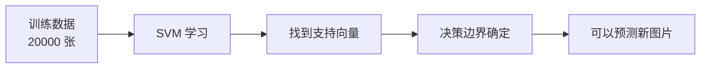
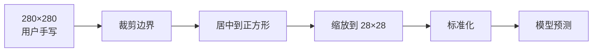

# 实战：手写数字识别

> 用一个完整的 MNIST 项目串联监督学习全流程——数据获取、预处理、模型训练、预测推理。

前面几章学了线性回归、逻辑回归、决策树、SVM 的原理，但"知道"和"会用"之间还差一个项目。手写数字识别（MNIST）是机器学习最经典的入门实战：给模型看大量手写数字图片，让它学会识别 0-9。这个项目虽然简单，但完整覆盖了 ML 工作流的每一步，是面试中"说说你做过的 ML 项目"的最佳练手素材。

本文基于 scikit-learn + MNIST 数据集，用 SVM 实现手写数字识别，并提供一个可交互的网页 Demo——你画数字，模型来猜。

::: tip 项目源码
完整代码在项目的 `examples/mnist/` 目录下，可直接运行体验。
:::

## MNIST 数据集

MNIST 是机器学习领域最经典的入门数据集，由美国国家标准与技术研究院（NIST）收集，Yann LeCun 等人整理发布。

| 属性 | 值 |
|------|------|
| 图片数量 | 70,000 张（60,000 训练 + 10,000 测试） |
| 图片尺寸 | 28 × 28 像素灰度图 |
| 类别数 | 10（数字 0-9） |
| 像素值范围 | 0（白）~ 255（黑） |
| 特征维度 | 784（28 × 28 展平） |

每张图片是一个 28×28 的灰度矩阵，展平后变成 784 维向量——这就是模型的输入特征。

```python
from sklearn.datasets import fetch_openml

# 从 OpenML 下载 MNIST，首次约 50MB，之后缓存在 ~/scikit_learn_data/
mnist = fetch_openml("mnist_784", version=1, as_frame=False, parser="auto")
X, y = mnist.data.astype(np.float64), mnist.target.astype(int)

print(X.shape)  # (70000, 784) — 70000 张图片，每张 784 个像素
print(y.shape)  # (70000,)     — 对应的标签（0-9）
```

::: details 为什么不用 sklearn 内置的 load_digits？
`load_digits` 只有 1797 张 8×8 的图片，分辨率太低，用户手写的数字缩到 8×8 后细节全丢了，模型难以准确识别。MNIST 的 28×28 分辨率和 70000 张样本量让模型有足够的数据学习，泛化效果好得多。
:::

## 数据预处理

拿到原始数据后不能直接喂给模型，需要两步预处理：**划分数据集**和**标准化**。

### 划分数据集

```python
from sklearn.model_selection import train_test_split

# 取 20000 条训练（完整 60000 条 SVM 太慢）
train_size = 20000
X, y = X_all[:train_size], y_all[:train_size]
```

为什么只取 20000 条？SVM 的训练时间复杂度约为 $O(n^2)$ 到 $O(n^3)$，60000 条数据训练会非常慢。20000 条已经足够获得不错的准确率（>97%），是速度和效果的平衡点。

### 标准化

```python
from sklearn.preprocessing import StandardScaler

scaler = StandardScaler()
X_scaled = scaler.fit_transform(X)  # 训练集：fit + transform
```

标准化公式：

$$x' = \frac{x - \mu}{\sigma}$$

- $\mu$ 是每个特征（像素位置）的均值
- $\sigma$ 是每个特征的标准差
- 变换后均值 ≈ 0，标准差 ≈ 1

**为什么必须标准化？** SVM 用 RBF 核函数计算样本间的距离。像素值范围 0~255，如果某些位置值域偏大，会主导距离计算。标准化让所有特征在同一尺度上，模型能公平对待每个像素。

::: warning 标准化的正确姿势
```python
# ✅ 正确：训练集 fit_transform，测试集只 transform
X_train_scaled = scaler.fit_transform(X_train)
X_test_scaled = scaler.transform(X_test)

# ❌ 错误：测试集也 fit_transform → 数据泄漏
X_test_scaled = scaler.fit_transform(X_test)
```
测试集必须用训练集的均值和标准差来变换，否则就是"偷看了考试答案"（数据泄漏）。
:::

## 模型训练

```python
from sklearn.svm import SVC

model = SVC(kernel="rbf", probability=True, random_state=42)
model.fit(X_scaled, y)
```

一行 `fit` 完成训练，但背后发生了很多事：

| 参数 | 含义 |
|------|------|
| `kernel="rbf"` | 使用高斯核函数，把数据映射到高维空间找分隔超平面 |
| `probability=True` | 启用概率估计，预测时能输出每个类别的概率 |
| `random_state=42` | 固定随机种子，保证每次训练结果一致 |

### SVM 在这个任务中做了什么

SVM 的目标是在 784 维空间中找到能把 10 个数字类别**最大间隔**分开的决策边界。

1. 对每对类别（如 "3" vs "5"）找到一个分隔超平面
2. RBF 核函数将线性不可分的数据映射到更高维空间，使之可分
3. 找到离决策边界最近的样本——**支持向量**
4. 最终模型只依赖这些支持向量做预测，大部分训练样本可以丢弃



## 图像预处理（用户手写 → 模型输入）

用户在 280×280 的画布上手写数字，但模型期望的输入是 28×28 的标准化向量。中间需要一系列图像处理步骤。

### 流程总览



### Step 1：提取笔迹

```python
img_array = np.array(raw_pixels, dtype=np.uint8).reshape(height, width)
```

前端 Canvas 把每个像素的透明度发过来：画过的地方 = 255（黑），没画的地方 = 0（白）。还原为 280×280 的二维矩阵。

### Step 2：裁剪到笔迹区域

```python
rows = np.any(img_array > 0, axis=1)  # 哪些行有笔迹
cols = np.any(img_array > 0, axis=0)  # 哪些列有笔迹
rmin, rmax = np.where(rows)[0][[0, -1]]  # 上下边界
cmin, cmax = np.where(cols)[0][[0, -1]]  # 左右边界

pad = 20  # 保留边距，模拟 MNIST 风格
cropped = img_array[rmin-pad:rmax+pad+1, cmin-pad:cmax+pad+1]
```

用户可能在画布任意位置画了一个小数字，大部分区域是空白。这一步找到笔迹的最小包围矩形，裁掉多余空白。保留 20px 边距是因为 MNIST 数据集中数字周围也有留白。

### Step 3：居中到正方形

```python
h, w = cropped.shape
size = max(h, w)
square = np.zeros((size, size), dtype=np.uint8)
y_offset = (size - h) // 2
x_offset = (size - w) // 2
square[y_offset:y_offset+h, x_offset:x_offset+w] = cropped
```

数字 "1" 很窄、"0" 接近正方形。直接缩放会变形。这一步把裁剪后的图像放入正方形画布并居中，保持数字的原始比例。

### Step 4：缩放到 28×28

```python
from PIL import Image

img = Image.fromarray(square)
img_28 = img.resize((28, 28), Image.LANCZOS)
result = np.array(img_28, dtype=np.float64).flatten()  # shape: (784,)
```

用 LANCZOS 算法高质量下采样，比简单的最近邻采样平滑得多。最终展平为 784 维向量，和训练数据格式完全一致。

## 预测推理

```python
pixels_scaled = scaler.transform(pixels.reshape(1, -1))  # 标准化

prediction = model.predict(pixels_scaled)[0]           # 最可能的数字
probabilities = model.predict_proba(pixels_scaled)[0]  # 10 个概率值
```

| 方法 | 输出 | 说明 |
|------|------|------|
| `scaler.transform` | 标准化后的向量 | 用训练集的 $\mu$ 和 $\sigma$，不能重新 fit |
| `model.predict` | 一个数字（0-9） | SVM 找到离哪个类别的决策边界最近 |
| `model.predict_proba` | 10 个概率 | 通过 Platt 缩放将 SVM 距离转换为概率 |

::: tip predict_proba 的原理
SVM 原生只输出"属于哪个类别"，不输出概率。设置 `probability=True` 后，scikit-learn 会用交叉验证拟合一个 Sigmoid 函数（Platt 缩放），把 SVM 的决策距离映射为 0~1 的概率值。这会增加训练时间，但让我们能看到模型的"信心程度"。
:::

## 完整代码

::: details 点击展开完整的交互式 Demo 代码

```python
import json
import webbrowser
import numpy as np
from PIL import Image
from http.server import HTTPServer, BaseHTTPRequestHandler
from sklearn.datasets import fetch_openml
from sklearn.preprocessing import StandardScaler
from sklearn.svm import SVC

IMG_SIZE = 28

def process_drawing(raw_pixels, width, height):
    """将用户手写图像转换为 MNIST 格式的 28x28 图像"""
    img_array = np.array(raw_pixels, dtype=np.uint8).reshape(height, width)

    # 找到笔迹边界框
    rows = np.any(img_array > 0, axis=1)
    cols = np.any(img_array > 0, axis=0)
    if not rows.any():
        return np.zeros(IMG_SIZE * IMG_SIZE)
    rmin, rmax = np.where(rows)[0][[0, -1]]
    cmin, cmax = np.where(cols)[0][[0, -1]]

    # 裁剪 + 边距
    pad = 20
    rmin, rmax = max(0, rmin - pad), min(height - 1, rmax + pad)
    cmin, cmax = max(0, cmin - pad), min(width - 1, cmax + pad)
    cropped = img_array[rmin:rmax+1, cmin:cmax+1]

    # 居中到正方形
    h, w = cropped.shape
    size = max(h, w)
    square = np.zeros((size, size), dtype=np.uint8)
    square[(size-h)//2:(size-h)//2+h, (size-w)//2:(size-w)//2+w] = cropped

    # 缩放到 28x28
    img_28 = Image.fromarray(square).resize((IMG_SIZE, IMG_SIZE), Image.LANCZOS)
    return np.array(img_28, dtype=np.float64).flatten()

# 加载数据 + 训练
mnist = fetch_openml("mnist_784", version=1, as_frame=False, parser="auto")
X_all, y_all = mnist.data.astype(np.float64), mnist.target.astype(int)

X, y = X_all[:20000], y_all[:20000]
scaler = StandardScaler()
X_scaled = scaler.fit_transform(X)

model = SVC(kernel="rbf", probability=True, random_state=42)
model.fit(X_scaled, y)

# 预测
def predict_digit(raw_pixels, width, height):
    pixels = process_drawing(raw_pixels, width, height).reshape(1, -1)
    pixels_scaled = scaler.transform(pixels)
    prediction = int(model.predict(pixels_scaled)[0])
    probabilities = model.predict_proba(pixels_scaled)[0].tolist()
    return prediction, probabilities
```

:::

## 面试高频问题

### Q1: 为什么 SVM 训练前要做标准化？⭐⭐

**答题思路**：
1. SVM 用 RBF 核计算样本间距离，距离对特征尺度敏感
2. 不标准化时，值域大的特征会主导距离计算
3. 标准化让所有特征在同一尺度，模型能公平对待每个特征
4. 加分：决策树不需要标准化，因为它只看特征的排序关系

### Q2: 训练集和测试集为什么要分别做标准化？⭐⭐⭐

**答题思路**：
1. 训练集用 `fit_transform`（计算均值/标准差 + 变换）
2. 测试集只用 `transform`（用训练集的统计量变换）
3. 如果测试集也 `fit_transform`，就泄漏了测试集的统计信息，相当于偷看了考试答案
4. 这叫**数据泄漏（Data Leakage）**，会高估模型的真实表现

### Q3: MNIST 这种图像任务，SVM 和 CNN 哪个更好？⭐⭐

**答题思路**：
1. SVM 在 MNIST 上能达到 ~98% 准确率，CNN 能达到 ~99.5%
2. SVM 把图片当作 784 维向量，丢失了空间结构信息（哪些像素相邻）
3. CNN 的卷积层能利用像素的空间关系，提取边缘、纹理等局部特征
4. 加分：简单任务（如 MNIST）差距不大，复杂图像任务（如 ImageNet）CNN 优势碾压

### Q4: 用户手写图片到模型预测之间要做哪些预处理？⭐⭐

**答题思路**：
1. 裁剪到笔迹区域（去掉空白）
2. 居中到正方形画布（保持比例不变形）
3. 缩放到训练数据尺寸（28×28）
4. 标准化（用训练集的均值和标准差）
5. 核心原则：让输入数据的分布尽量接近训练数据

### Q5: SVM 的 `probability=True` 是怎么实现的？⭐

**答题思路**：
1. SVM 原生不输出概率，只输出类别
2. `probability=True` 使用 Platt 缩放——用交叉验证拟合一个 Sigmoid 函数
3. 将 SVM 的决策距离映射为 0~1 的概率值
4. 代价：训练时间增加（需要额外的交叉验证）

## 一张表回顾

| 知识点 | 核心要义 | 掌握程度 |
|--------|---------|---------|
| MNIST 数据集 | 70000 张 28×28 手写数字，ML 入门标配 | ⭐⭐ 理解 |
| 数据标准化 | $x' = (x - \mu) / \sigma$，基于距离的算法必须做 | ⭐⭐⭐ 必须 |
| 数据泄漏 | 测试集不能 fit，只能用训练集的统计量 transform | ⭐⭐⭐ 必须 |
| SVM 训练 | 找最大间隔超平面，RBF 核处理非线性 | ⭐⭐ 理解 |
| 图像预处理 | 裁剪 → 居中 → 缩放 → 标准化，对齐训练数据分布 | ⭐⭐ 理解 |
| predict vs predict_proba | 前者输出类别，后者通过 Platt 缩放输出概率 | ⭐ 了解 |
| SVM vs CNN | SVM 丢失空间信息，CNN 利用局部特征，复杂图像任务 CNN 碾压 | ⭐⭐ 理解 |
