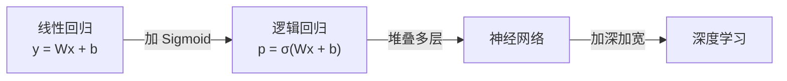
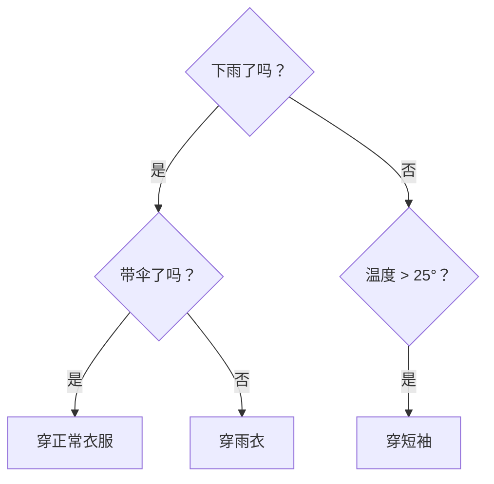

# 监督学习

> 有老师给答案的学习方式——给数据贴标签，让模型学会从输入预测输出。

监督学习是机器学习中**最常用、最核心**的学习范式。类比：老师给你一堆已批改的试卷（带标准答案），你从中学习规律，然后去做一张全新的试卷——这就是监督学习。它的核心在于"有标签"，即每条训练数据都有对应的正确答案。

面试中"说说你了解的 ML 算法"几乎等于在问监督学习算法。线性回归、逻辑回归、决策树、SVM、KNN——这些经典算法都属于监督学习，是算法岗和客户端 AI 岗的基础考点。

## 分类与回归

监督学习只做两件事：**分类**和**回归**。区分很简单——看输出是"几选一"还是"一个数字"。

| 任务 | 输出类型 | 典型问题 | 例子 |
|------|---------|---------|------|
| **分类** | 离散类别 | "是什么？" | 图片 → 猫/狗、邮件 → 垃圾/正常 |
| **回归** | 连续数值 | "是多少？" | 房屋特征 → 房价、气象数据 → 降雨量 |

**"这是猫还是狗？"** → 分类（答案是有限的类别）
**"这套房子值多少钱？"** → 回归（答案是一个连续数字）

::: tip 二分类 vs 多分类
分类又细分两种：**二分类**（是/否、垃圾/正常）和**多分类**（猫/狗/鸟/鱼）。大多数分类算法天然支持二分类，多分类通常通过 One-vs-Rest（每个类别训练一个二分类器）来实现。
:::

## 线性回归

用一条直线拟合数据，预测**连续数值**。它是最简单的监督学习算法，也是理解神经网络的起点。

**类比**：你观察到面积越大的房子越贵，于是画一条直线来描述这个规律。

### 模型公式

$$y = Wx + b$$

- `W`（权重 / 斜率）：面积每增加 1 平方米，房价涨多少
- `b`（偏置 / 截距）：基础价格

假设 `W = 2`（万/平方米），`b = 50`（万）：

| 面积 | 计算过程 | 预测房价 |
|------|---------|---------|
| 50 m² | 2 × 50 + 50 | 150 万 |
| 80 m² | 2 × 80 + 50 | 210 万 |
| 100 m² | 2 × 100 + 50 | 250 万 |

### 怎么找到最好的 W 和 b

目标：让预测值和真实值的差距最小。用 **MSE（均方误差）** 作为损失函数：

$$\text{Loss} = \frac{1}{n}\sum_{i=1}^{n}(\hat{y}_i - y_i)^2$$

然后用**梯度下降**不断调整 `W` 和 `b`，让 Loss 越来越小。

::: tip 和深度学习的关系
神经网络中每一层的核心计算就是 `y = Wx + b`。深度学习 = 多层线性回归 + 激活函数。理解了线性回归，就理解了神经网络的基本单元。
:::

## 逻辑回归

名字里有"回归"，但实际做的是**分类**任务。它在线性回归的基础上加了一步——用 Sigmoid 函数把结果压到 0~1 之间，表示概率。

| 模型 | 公式 | 输出 |
|------|------|------|
| 线性回归 | `y = Wx + b` | 任意数值 |
| 逻辑回归 | `p = sigmoid(Wx + b)` | 0~1 之间的概率 |

### Sigmoid 函数

Sigmoid 把任意数字压缩到 0~1 之间，输出可以理解为"属于某个类别的概率"：

| 输入值 | Sigmoid 输出 | 含义 |
|--------|-------------|------|
| -10 | 0.00005 | 几乎不可能 |
| -2 | 0.12 | 12% 概率 |
| 0 | 0.50 | 不确定 |
| 2 | 0.88 | 88% 概率 |
| 10 | 0.99995 | 几乎确定 |

通常以 0.5 为阈值：`p ≥ 0.5` 判为正类，`p < 0.5` 判为负类。

### 实例：垃圾邮件检测

```python
# 特征
x1 = 2   # 包含"免费"的次数
x2 = 1   # 包含"中奖"的次数
x3 = 0   # 发件人是否在通讯录（0=否, 1=是）

# 模型学到的参数
W1, W2, W3, b = 2.0, 3.0, -5.0, -1.0
# 注意 W3 是负数 → 在通讯录中会大幅降低垃圾邮件概率

z = W1*x1 + W2*x2 + W3*x3 + b  # = 4 + 3 + 0 - 1 = 6
p = sigmoid(6)  # ≈ 0.9975 → 99.75% 是垃圾邮件
```

### 损失函数：交叉熵

逻辑回归不用 MSE，而是用**二元交叉熵（Binary Cross Entropy）**：

$$\text{Loss} = -\frac{1}{n}\sum[y\log(\hat{y}) + (1-y)\log(1-\hat{y})]$$

直觉：当真实标签 `y=1` 时，模型预测的概率 `ŷ` 越接近 1，loss 越小；反之 loss 越大。

::: tip 和深度学习的关系
逻辑回归 ≈ 一个没有隐藏层的神经网络。理解了逻辑回归，就理解了神经网络最基本的单元。
:::

### 从线性回归到深度学习



## 决策树

用一系列"是/否"问题来做决策，像一棵倒过来的树。

**类比**：你决定今天穿什么——下雨吗？→ 温度高吗？→ 一步步做出决定。决策树做的事情一模一样，只是它自动从数据中学会该问哪些问题。



### 怎么决定先问哪个问题

核心思路：**先问最能区分数据的问题**。

类比"猜人游戏"（20 Questions）：
- 好问题："这个人是男性吗？" → 一下排除一半
- 差问题："这个人姓张吗？" → 只排除很少一部分

在决策树中，"最能区分数据"用**信息增益（Information Gain）**来衡量。信息增益越大，说明这个问题把数据分得越开，优先问。

### 优缺点

| | 说明 |
|------|------|
| **优点** | 直观可解释、不需要标准化数据、能处理数值和类别特征 |
| **缺点** | 容易过拟合（树太深 = 记住了所有细节）、对数据微小变化敏感 |

**解决过拟合**：限制树的深度，或者用**随机森林**。

### 随机森林

随机森林 = 训练很多棵决策树，最终**投票**决定结果。

**类比**：一个人判断容易出错，但 100 个人各自独立判断，取多数意见，结果通常更靠谱。这就是**集成学习**的思想。

::: warning 面试常考
"如何解决决策树过拟合？"——随机森林是标准答案之一。随机森林通过两个"随机"来保证多样性：随机抽样训练数据 + 随机选择特征子集。
:::

## KNN（K 近邻）

KNN（K-Nearest Neighbors）不需要训练，预测时直接**看离它最近的 K 个邻居，多数是什么类别就判它是什么**。

**类比**：你搬到新小区，想知道这里算"富人区"还是"普通区"。做法：看你最近的 5 家邻居（K=5），3 家是豪宅、2 家是普通房 → 多数是豪宅 → 判定为"富人区"。

### K 值选择

| K 值 | 效果 | 问题 |
|------|------|------|
| K 太小（如 K=1） | 只看最近的 1 个邻居 | 容易被噪声影响 → 过拟合 |
| K 太大（如 K=100） | 看太多邻居 | 把不相关的都算进来 → 欠拟合 |
| **推荐** | **K = 3~10 的奇数** | 奇数避免投票平局 |

### 优缺点

| | 说明 |
|------|------|
| **优点** | 简单直观、不需要训练、适合小数据集 |
| **缺点** | 预测慢（每次都要算和所有数据的距离）、数据量大时不实用、对特征尺度敏感（需要标准化） |

## SVM（支持向量机）

SVM（Support Vector Machine）的核心思想：找一条线（或平面），把不同类别的数据**尽量分开**，并且让这条线离两边数据**都尽量远**。

**类比**：在操场上画一条线把男生和女生分开。紧贴着一边画 → 不好，稍微有人站偏就分错了；画在正中间 → 好，离两边都远，容错空间大。SVM 就是找"正中间"那条线。

### 核函数

如果数据不能用一条直线分开怎么办？

**类比**：桌面上（2D）红豆和绿豆混在一起，画不了直线分开。把桌面掀起来变成碗的形状（映射到更高维度），在碗里就能找到一个平面把它们分开了。

**核函数 = 实现"掀桌子"的数学工具**。常用的有：

| 核函数 | 说明 | 适用场景 |
|--------|------|---------|
| 线性核 | 不变换，直接画直线 | 数据本身线性可分 |
| RBF 核（高斯核） | 最常用，映射到无穷维 | 大多数场景的默认选择 |
| 多项式核 | 映射到有限高维 | 数据有多项式关系 |

## 特征工程

特征工程 = **把原始数据加工成模型更容易理解的形式**。

**类比**：做菜。原始食材（原始数据）→ 洗、切、调味（特征工程）→ 下锅（模型训练）。食材处理得好，菜就好吃。

| 操作 | 做什么 | 为什么需要 |
|------|--------|-----------|
| **标准化** | 缩放到统一范围（均值 0、标准差 1） | 房价 100~500 万，面积 50~200 m²，尺度差太大会让模型被大数字带偏 |
| **独热编码** | 类别变量变成 0/1 向量 | 颜色"红/绿/蓝"不能用 1/2/3，否则模型以为蓝 > 绿 > 红 |
| **缺失值处理** | 填充或删除缺失数据 | 某些样本缺少特征值 |
| **特征选择** | 去掉不重要的特征 | 减少噪声，加快训练 |

独热编码示例：

```python
# 颜色 = "红" → [1, 0, 0]
# 颜色 = "绿" → [0, 1, 0]
# 颜色 = "蓝" → [0, 0, 1]

# 为什么不用 红=1, 绿=2, 蓝=3？
# 因为模型会以为 3 > 2 > 1，即"蓝 > 绿 > 红"
# 但颜色之间没有大小关系！
```

::: tip 深度学习 vs 特征工程
深度学习的一大优势是能**自动学特征**（如卷积层自动提取图像特征），不太需要手动做特征工程。但在传统 ML 中，特征工程的好坏往往决定了模型效果的上限。
:::

## 算法选型

| 任务 | 推荐算法 | 一句话理由 |
|------|---------|-----------|
| 预测数值（房价） | 线性回归 | 最简单，先试这个 |
| 二分类（垃圾邮件） | 逻辑回归 | 简单、快、可解释 |
| 多分类（手写数字） | 决策树 / 随机森林 | 不需要太多数据预处理 |
| 小数据分类 | KNN | 不用训练，但预测慢 |
| 高维数据分类 | SVM | 高维空间中表现好 |
| 表格数据竞赛 / 生产 | XGBoost / LightGBM | 实际工作中最常用 |
| 图像 / 文本 / 语音 | 深度学习 | 自动特征提取，效果碾压传统 ML |

::: details XGBoost / LightGBM
这两个是面试中经常被提到的算法。它们本质是"把很多弱的决策树组合在一起变成强模型"，叫做**梯度提升（Gradient Boosting）**。Kaggle 竞赛中表格数据的冠军方案绝大多数使用它们。
:::

## scikit-learn 快速上手

scikit-learn 是 Python 中最流行的传统 ML 库。所有算法的 API 高度统一：**创建 → fit → predict** 三步。

```python
from sklearn.linear_model import LinearRegression, LogisticRegression
from sklearn.tree import DecisionTreeClassifier
from sklearn.neighbors import KNeighborsClassifier
from sklearn.svm import SVC

# 线性回归
model = LinearRegression()
model.fit(X_train, y_train)       # 训练
y_pred = model.predict(X_test)    # 预测

# 逻辑回归
model = LogisticRegression()
model.fit(X_train, y_train)
y_pred = model.predict(X_test)

# 决策树（限制深度防过拟合）
model = DecisionTreeClassifier(max_depth=5)
model.fit(X_train, y_train)
y_pred = model.predict(X_test)

# KNN
model = KNeighborsClassifier(n_neighbors=5)
model.fit(X_train, y_train)
y_pred = model.predict(X_test)

# SVM
model = SVC(kernel='rbf')
model.fit(X_train, y_train)
y_pred = model.predict(X_test)

# 换算法只需换第 1 行，其余代码不用改
```

## 面试高频问题

### Q1: 线性回归和逻辑回归的区别？⭐⭐

**答题思路**：
1. 线性回归做**回归**（预测连续值），逻辑回归做**分类**（预测类别概率）
2. 逻辑回归 = 线性回归 + Sigmoid，把输出压到 0~1
3. 损失函数不同：线性回归用 MSE，逻辑回归用交叉熵
4. 加分：逻辑回归是神经网络的基本单元

### Q2: 决策树为什么容易过拟合？怎么解决？⭐⭐⭐

**答题思路**：
1. 树太深时会记住训练数据的每个细节，泛化能力差
2. 解决方法：限制树深度、限制叶节点最小样本数、剪枝
3. 更好的方法：随机森林（多棵树投票，降低方差）
4. 加分：随机森林通过"随机抽样 + 随机选特征"保证树之间的多样性

### Q3: KNN 的 K 值怎么选？⭐⭐

**答题思路**：
1. K 太小 → 过拟合（被噪声影响），K 太大 → 欠拟合（边界模糊）
2. 通常取 3~10 之间的奇数（避免平局）
3. 实践中用交叉验证选最优 K
4. 加分：KNN 的缺点是预测慢（O(n) 计算距离），大数据量不适用

### Q4: SVM 中核函数的作用是什么？⭐⭐

**答题思路**：
1. 当数据在原始空间不可线性分隔时，核函数将数据映射到更高维空间
2. 在高维空间中找到线性分隔超平面
3. 常用核函数：RBF（默认选择）、线性核、多项式核
4. 加分：核技巧的妙处在于不需要真的做高维映射，直接在原空间计算内积

### Q5: 特征工程中为什么要做标准化？⭐⭐

**答题思路**：
1. 不同特征的量纲差异大（房价百万级，面积百级），模型会被大数值特征主导
2. 标准化让所有特征在同一尺度上，模型能公平对待每个特征
3. 基于距离的算法（KNN、SVM）和梯度下降优化的模型**必须**标准化
4. 决策树类算法不需要标准化（它只看特征的排序关系）

## 一张表回顾

| 知识点 | 核心要义 | 掌握程度 |
|--------|---------|---------|
| 分类 vs 回归 | 离散类别 vs 连续数值，看输出类型区分 | ⭐⭐⭐ 必须 |
| 线性回归 | `y = Wx + b`，MSE 损失 + 梯度下降 | ⭐⭐⭐ 必须 |
| 逻辑回归 | 线性回归 + Sigmoid，做分类，交叉熵损失 | ⭐⭐⭐ 必须 |
| 决策树 | 用"是/否"问题分数据，信息增益选最优问题 | ⭐⭐⭐ 必须 |
| 随机森林 | 多棵决策树投票，降低过拟合 | ⭐⭐ 理解 |
| KNN | 看最近 K 个邻居投票，不需要训练 | ⭐⭐ 理解 |
| SVM | 找最大间隔分隔面，核函数处理非线性 | ⭐ 了解 |
| 特征工程 | 标准化、独热编码、缺失值处理、特征选择 | ⭐⭐ 理解 |
| 算法选型 | 表格数据用 XGBoost，图像文本用深度学习 | ⭐⭐ 理解 |
| scikit-learn | 统一 API：fit → predict，换算法只换一行 | ⭐ 了解 |
