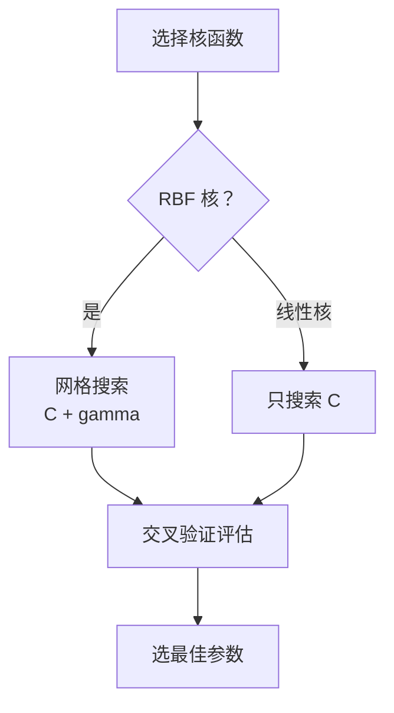

# SVM 支持向量机

> 在所有能分对数据的边界中，找间隔最大的那个——这就是 SVM 的核心思想。

在监督学习那篇中，我们用"操场画线分男女"类比了 SVM 的基本想法。但面试中 SVM 是高频考点，光知道"找最大间隔"远远不够——你还需要理解支持向量是什么、C 参数怎么调、核技巧为什么能"以小搏大"。这篇文章就来把 SVM 从直觉到公式、从原理到调参讲透。

## 最大间隔

SVM 的目标可以用一句话概括：**在所有能正确分类的决策边界中，选那个离两边数据都最远的**。

**类比**：一条公路把两个村子分开。窄路（间隔小）稍微有人走偏就跑到对面村子了；宽路（间隔大）容错空间大，偶尔偏一点也没事。SVM 就是要找"最宽的马路"。

### 关键概念

| 术语 | 含义 |
|------|------|
| **超平面**（Hyperplane） | 分隔数据的决策边界。二维空间中是一条线，三维中是一个面，高维中叫超平面 |
| **间隔**（Margin） | 超平面到最近样本的距离 × 2，即"马路的宽度" |
| **支持向量**（Support Vector） | 离超平面最近的那些样本点。它们"撑住"了马路的边界——去掉任何一个，边界都可能移动 |


为什么叫"支持"向量？因为最终模型**只依赖这些点**。其他离边界很远的样本删掉、移动都不影响决策边界，只有紧贴边界的这几个样本在"支撑"着边界的位置。

### 数学表述

超平面用方程 $w \cdot x + b = 0$ 表示，其中 $w$ 是法向量（决定方向），$b$ 是偏置（决定位置）。

SVM 的优化目标：

$$\min_{w, b} \frac{1}{2} \|w\|^2 \quad \text{s.t.} \quad y_i(w \cdot x_i + b) \geq 1, \quad \forall i$$

直觉解读：
- $\|w\|$ 越小 → 间隔越大（间隔 = $\frac{2}{\|w\|}$）
- 约束条件 $y_i(w \cdot x_i + b) \geq 1$ 保证所有样本都被正确分类，且离边界至少距离 1

::: tip 为什么最小化 ||w|| 等于最大化间隔？
间隔的宽度 = $\frac{2}{\|w\|}$。$\|w\|$ 越小，分母越小，间隔越大。为了数学方便，把"最大化 $\frac{2}{\|w\|}$"转化为"最小化 $\frac{1}{2}\|w\|^2$"（去掉根号、加个常数系数，不影响最优解）。
:::

## 软间隔与 C 参数

上面的"硬间隔"要求所有样本都正确分类。但现实数据有噪声——可能有几个异常点混在对面阵营里，硬要全分对会导致间隔极窄（过拟合），甚至根本找不到分隔面。

**类比**：考试阅卷。严格老师（硬间隔）一分不扣漏地改，学生稍有含糊就算错；宽松老师（软间隔）允许一些小失误，只要大方向对就给分。软间隔就是让模型"宽松一点"。

### 松弛变量

引入松弛变量 $\xi_i \geq 0$，允许部分样本违反约束：

$$\min_{w, b, \xi} \frac{1}{2} \|w\|^2 + C \sum_{i=1}^{n} \xi_i \quad \text{s.t.} \quad y_i(w \cdot x_i + b) \geq 1 - \xi_i$$

- $\xi_i = 0$：样本被正确分类，且在间隔外
- $0 < \xi_i < 1$：样本在间隔内，但还在正确的一侧
- $\xi_i \geq 1$：样本被分错了

### C 参数的作用

$C$ 控制"对错误的容忍程度"：

| C 值 | 行为 | 类比 |
|------|------|------|
| C 很大 | 几乎不允许犯错，间隔窄 | 严格老师，一分不让 |
| C 很小 | 允许较多错误，间隔宽 | 宽松老师，大方向对就行 |
| C → ∞ | 退化为硬间隔 SVM | 完美主义 |

```python
from sklearn.svm import SVC

# C 大：拟合更紧密（可能过拟合）
model_tight = SVC(kernel="rbf", C=100)

# C 小：更宽松（可能欠拟合）
model_loose = SVC(kernel="rbf", C=0.01)

# 默认 C=1，通常是个不错的起点
model_default = SVC(kernel="rbf", C=1)
```

::: warning C 不是越大越好
C 太大模型会努力记住每一个训练样本（包括噪声），导致过拟合。实际使用时需要通过交叉验证找到合适的 C 值。
:::

## 合页损失（Hinge Loss）

SVM 的优化目标可以等价地写成一个损失函数的形式：

$$L_{\text{hinge}} = \max(0, 1 - y_i \cdot f(x_i))$$

其中 $f(x_i) = w \cdot x_i + b$ 是模型的输出值。

直觉理解：
- **分对了，且离边界很远**（$y_i \cdot f(x_i) > 1$）→ 损失 = 0，不需要优化
- **分对了，但离边界太近**（$0 < y_i \cdot f(x_i) < 1$）→ 有损失，要把它推远
- **分错了**（$y_i \cdot f(x_i) < 0$）→ 大损失，重点惩罚

### Hinge Loss vs 交叉熵

| 对比项 | Hinge Loss（SVM） | 交叉熵（逻辑回归） |
|--------|-------------------|-------------------|
| 公式 | $\max(0, 1 - y \cdot f(x))$ | $-[y\log p + (1-y)\log(1-p)]$ |
| 分对且远离边界 | 损失 = 0（不关心了） | 损失仍 > 0（继续优化） |
| 关注点 | 只关心边界附近的样本 | 关心所有样本 |
| 产生稀疏性 | 是（只有支持向量有非零贡献） | 否 |

这个区别很重要：Hinge Loss 让 SVM 只在乎"难分的样本"（支持向量），已经分对的样本完全不参与优化。这就是为什么 SVM 的决策边界只由少数支持向量决定。

## 核函数与核技巧

### 为什么需要核函数

很多数据在原始空间中线性不可分——你画不出一条直线把它们分开。

**类比升级**：桌子上（2D）红豆和绿豆混在一起，用直尺画不出分界线。但如果你把桌子"掀"成碗的形状——红豆滚到碗底，绿豆留在碗沿——在碗的内部（3D 空间）就能找到一个平面把它们分开了。

核函数就是实现这个"掀桌子"操作的数学工具。它把数据从低维空间映射到高维空间，在高维空间中找线性分隔面。

### 核技巧（Kernel Trick）

直接算高维映射 $\phi(x)$ 计算量巨大（RBF 核甚至映射到无穷维）。核技巧的精妙之处：**SVM 的优化过程只需要计算样本之间的内积 $\phi(x_i) \cdot \phi(x_j)$，不需要知道 $\phi$ 的具体形式**。

核函数 $K(x_i, x_j) = \phi(x_i) \cdot \phi(x_j)$ 直接在原始空间中计算，结果等价于在高维空间中计算内积。

一句话总结：**不用真的"掀桌子"，只需要知道掀完之后两个豆子之间的距离就够了**。

### RBF 核（高斯核）

RBF 核是最常用的核函数：

$$K(x_i, x_j) = \exp\left(-\gamma \|x_i - x_j\|^2\right)$$

- 两个样本越近，$K$ 值越接近 1
- 两个样本越远，$K$ 值越接近 0
- $\gamma$ 控制"多近算近"

### gamma 参数

| gamma 值 | 行为 | 类比 |
|----------|------|------|
| gamma 大 | 只看很近的邻居，决策边界复杂 | 近视眼，只看到身边的人 |
| gamma 小 | 看得远，决策边界平滑 | 远视眼，看全局 |

```python
# gamma 大：过拟合风险
model = SVC(kernel="rbf", gamma=10)

# gamma 小：欠拟合风险
model = SVC(kernel="rbf", gamma=0.001)

# 默认 gamma="scale"，即 1 / (n_features × X.var())
model = SVC(kernel="rbf", gamma="scale")
```

### 核函数选择指南

| 核函数 | 公式 | 何时用 |
|--------|------|--------|
| 线性核 | $K = x_i \cdot x_j$ | 特征多（>1000）、数据量大、本身线性可分 |
| RBF 核 | $K = \exp(-\gamma\|x_i - x_j\|^2)$ | 不确定时的默认选择，大多数场景 |
| 多项式核 | $K = (x_i \cdot x_j + r)^d$ | 数据有明确的多项式关系 |

::: tip 选核函数的经验法则
不知道选什么？先试 RBF。如果特征维度很高（如文本分类的 TF-IDF 特征），试线性核——高维空间中数据通常已经线性可分，用 RBF 反而多此一举。
:::

## 多分类策略

SVM 天生是二分类器（找一个超平面分两类）。处理多分类（如手写数字 0-9）需要组合多个二分类器。

### OvO vs OvR

| 策略 | 全称 | 做法 | 分类器数量 |
|------|------|------|-----------|
| OvO | One-vs-One | 每两个类别训练一个分类器，投票决定 | $\frac{n(n-1)}{2}$ |
| OvR | One-vs-Rest | 每个类别 vs 其余所有类别 | $n$ |

以 MNIST（10 类）为例：
- OvO：$\frac{10 \times 9}{2} = 45$ 个分类器，每个分类器训练数据少但数量多
- OvR：10 个分类器，每个分类器训练数据多但类别不平衡

```python
from sklearn.svm import SVC, LinearSVC

# SVC 默认用 OvO（适合小数据集）
model_ovo = SVC(kernel="rbf")

# LinearSVC 默认用 OvR（适合大数据集）
model_ovr = LinearSVC()
```

## SVM vs 逻辑回归

这是面试中最常被问到的对比之一。

| 对比维度 | SVM | 逻辑回归 |
|---------|-----|---------|
| 损失函数 | Hinge Loss | 交叉熵 |
| 关注的样本 | 只关心支持向量（边界附近） | 关心所有样本 |
| 输出 | 类别（默认不输出概率） | 概率（天然输出） |
| 决策边界 | 由少数支持向量决定 | 由全部样本共同决定 |
| 对异常值 | 较鲁棒（远处样本不影响） | 较敏感（所有样本都参与） |
| 高维小样本 | 表现好 | 表现一般 |
| 大规模数据 | 慢（$O(n^2)$~$O(n^3)$） | 快 |
| 可解释性 | 较弱 | 较强（系数可解释） |

**一句话总结**：数据量小、维度高、不需要概率输出 → SVM；数据量大、需要概率、需要解释模型 → 逻辑回归。

## 实战调参

SVM 的效果很大程度取决于 `C` 和 `gamma` 两个超参数。用 `GridSearchCV` 做网格搜索：

```python
from sklearn.svm import SVC
from sklearn.model_selection import GridSearchCV
from sklearn.preprocessing import StandardScaler
from sklearn.pipeline import Pipeline

# 把标准化和 SVM 串成 Pipeline，避免数据泄漏
pipe = Pipeline([
    ("scaler", StandardScaler()),
    ("svm", SVC(kernel="rbf")),
])

# 搜索 C 和 gamma 的最佳组合
param_grid = {
    "svm__C": [0.1, 1, 10, 100],
    "svm__gamma": ["scale", 0.01, 0.001],
}

grid = GridSearchCV(pipe, param_grid, cv=5, scoring="accuracy", n_jobs=-1)
grid.fit(X_train, y_train)

print(f"最佳参数: {grid.best_params_}")
print(f"最佳准确率: {grid.best_score_:.4f}")
```

### 调参流程



::: warning 三个常见坑
1. **忘记标准化**：SVM 基于距离，特征尺度不一致效果差。用 `Pipeline` 把 `StandardScaler` 和 `SVC` 绑在一起
2. **数据量太大**：超过 10 万条考虑用 `LinearSVC` 或换算法（如 XGBoost）
3. **直接用默认参数**：`C=1, gamma="scale"` 不一定适合你的数据，至少做一轮网格搜索
:::

## 面试高频问题

### Q1: 什么是支持向量？为什么叫"支持"？⭐⭐

**答题思路**：
1. 支持向量是离决策边界最近的样本点
2. 它们"支撑"着决策边界的位置——移除任何一个支持向量，边界都可能改变
3. SVM 的最终模型只依赖支持向量，其他样本可以删掉不影响结果
4. 加分：这也是 SVM 的优势——模型简洁，只存储支持向量即可

### Q2: C 参数怎么理解？怎么调？⭐⭐⭐

**答题思路**：
1. C 是对错误分类的惩罚力度
2. C 大 → 尽量不犯错 → 间隔窄 → 容易过拟合
3. C 小 → 允许犯错 → 间隔宽 → 可能欠拟合
4. 实践中用交叉验证 + 网格搜索找最佳 C 值

### Q3: 核技巧的意义是什么？⭐⭐⭐

**答题思路**：
1. 核函数把数据映射到高维空间，让线性不可分变成线性可分
2. 核技巧的精妙：不需要显式计算高维映射 $\phi(x)$，只需要计算核函数 $K(x_i, x_j)$
3. 好处：计算量大大降低。RBF 核映射到无穷维，直接算不可能，但核函数只需一个 `exp` 运算
4. 加分：不是所有函数都能当核函数，需要满足 Mercer 条件（正半定）

### Q4: SVM 和逻辑回归有什么区别？⭐⭐

**答题思路**：
1. 损失函数不同：Hinge Loss vs 交叉熵
2. SVM 只关心支持向量（边界附近的样本），逻辑回归关心所有样本
3. SVM 默认不输出概率，逻辑回归天然输出概率
4. 选择：小数据高维 → SVM；大数据需要概率 → 逻辑回归

### Q5: SVM 为什么必须做标准化？⭐⭐

**答题思路**：
1. SVM 用距离（内积）来衡量样本相似度
2. 特征尺度不一致时，值域大的特征会主导距离计算
3. 标准化让所有特征在同一尺度上，模型能公平对待每个特征
4. 加分：决策树不需要标准化，因为它只看特征的排序关系，不涉及距离计算

## 一张表回顾

| 知识点 | 核心要义 | 掌握程度 |
|--------|---------|---------|
| 最大间隔 | 找离两边最远的决策边界，间隔 = $\frac{2}{\|w\|}$ | ⭐⭐⭐ 必须 |
| 支持向量 | 离边界最近的点，模型只依赖它们 | ⭐⭐⭐ 必须 |
| 软间隔与 C | C 控制对错误的容忍度，C 大→紧密拟合，C 小→宽松 | ⭐⭐⭐ 必须 |
| Hinge Loss | $\max(0, 1-y \cdot f(x))$，分对且远→损失为 0 | ⭐⭐ 理解 |
| 核技巧 | 不需要显式映射到高维，用核函数直接算内积 | ⭐⭐⭐ 必须 |
| RBF 核 gamma | gamma 大→只看近邻→过拟合，gamma 小→看全局→欠拟合 | ⭐⭐ 理解 |
| OvO vs OvR | OvO 两两配对投票，OvR 一对多取最大 | ⭐ 了解 |
| SVM vs 逻辑回归 | SVM 关注边界附近，LR 关注全部；小数据高维选 SVM | ⭐⭐ 理解 |
| 调参实践 | 用 GridSearchCV 搜索 C 和 gamma，必须标准化 | ⭐⭐ 理解 |
